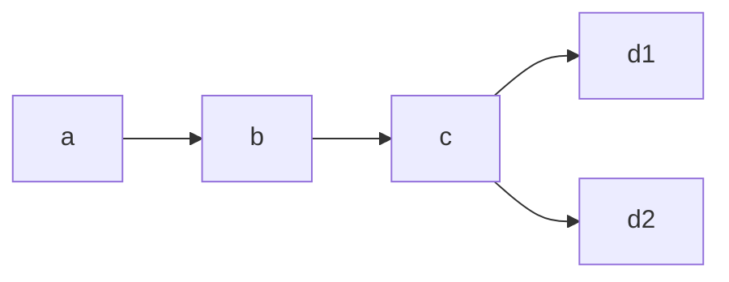
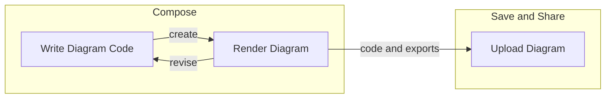

# Tip of the Week: Diagrams as Code

> Each week we seek to provide a software tip of the week geared towards helping you achieve your software goals. If you have any software questions or suggestions for an upcoming tip of the week, please don’t hesitate to reach out to #software-engineering on Slack or email DBMISoftwareEngineering at olucdenver.onmicrosoft.com

Diagrams can be a useful way to illuminate and communicate ideas. Free-form drawing or drag and drop tools are one common way to create diagrams. With this tip of the week we introduce another option: diagrams as code (DaC), or creating diagrams by using code.

__TLDR (too long, didn't read);__
Diagrams as code (DaC) tools provide an advantage for illustrating concepts by enabling __quick visual positioning__, __source controllable input__, __portability (both for input and output formats)__, and __open collaboration through reproducibility__. Consider trying or using the following diagrams as code tools: [Mermaid](https://mermaid-js.github.io/mermaid/), [PlantUML](https://plantuml.com/), or [Vega](https://vega.github.io/vega/). Mermaid in particular can be used directly within markdown files, Github comments, and elsewhere.

## Example Mermaid Diagram as Code



<table>
<tr>
<td>

````shell
flowchart LR
    a --> b
    b --> c
    c --> d1
    c --> d2
````

</td>
<td>



</td>
</tr>
<tr>
<td>Mermaid Code</td>
<td>Mermaid Rendered</td>
</tr>
</table>

## Workflow




