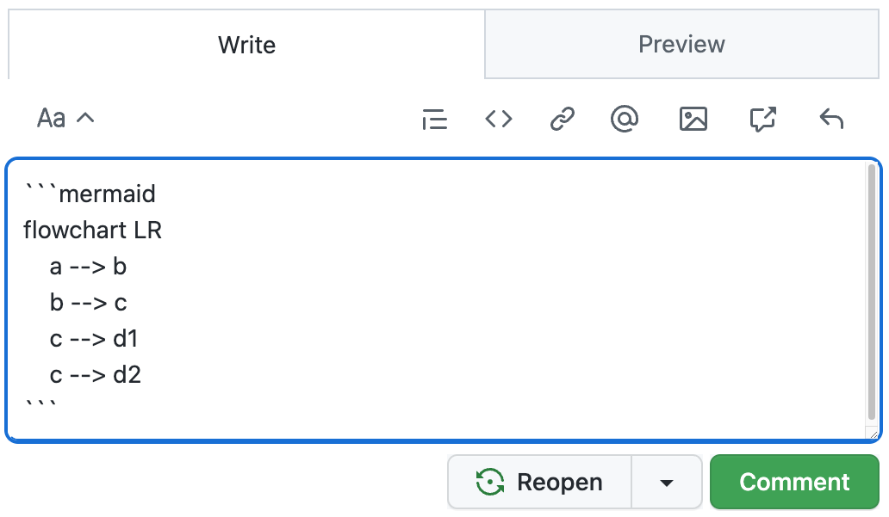

# Tip of the Week: Diagrams as Code

> Each week we seek to provide a software tip of the week geared towards helping you achieve your software goals. If you have any software questions or suggestions for an upcoming tip of the week, please don’t hesitate to reach out to #software-engineering on Slack or email DBMISoftwareEngineering at olucdenver.onmicrosoft.com

Diagrams can be a useful way to illuminate and communicate ideas. Free-form drawing or drag and drop tools are one common way to create diagrams. With this tip of the week we introduce another option: diagrams as code (DaC), or creating diagrams by using code.

__TLDR (too long, didn't read);__
Diagrams as code (DaC) tools provide an advantage for illustrating concepts by enabling __quick visual positioning__, __source controllable input__, __portability (both for input and output formats)__, and __open collaboration through reproducibility__. Consider using [Mermaid](https://mermaid-js.github.io/mermaid/) (as well as many other DaC tools) to assist your diagramming efforts which can be used directly, within in your markdown files, or [Github commentary](https://docs.github.com/en/get-started/writing-on-github/working-with-advanced-formatting/creating-diagrams#creating-mermaid-diagrams) using code blocks (for example, ` ```mermaid `).

## Example Mermaid Diagram as Code



<table>
<tr>
<td>

````shell
flowchart LR
    a --> b
    b --> c
    c --> d1
    c --> d2
````

</td>
<td>


</td>
</tr>
<tr>
<td>Mermaid Code</td>
<td>Mermaid Rendered</td>
</tr>
</table>

The above table shows an example [mermaid flowchart](https://mermaid-js.github.io/mermaid/#/flowchart) code and it's rendered output. The syntax is specific to mermaid and acts as a simple coding language to help you depict ideas. Mermaid also includes options for sequence, class, gantt, and other diagram types. Mermaid provides a [live editor](https://mermaid.live/edit#pako:eNpVzD1PwzAQBuC_Et2cRv6KL_HABBtT2SovV9vQCBxXlqPSRvnvhFRI9KZ73vuYwSUfwMD7V7q4E-VSve7tWK1F1W73VB3vOG5wd7gNnj9IQA0x5EiDX9_NvzML5RRisGDW1lP-tGDHZd2jqaS36-jAlDyFGqazpxKeB_rIFB_DFz-UlP-yM42HlOI_gpnhGww2vMMee62kapliqoYrmJ41SjONrOVSSN21Sw237Z43DLVgXCNKIWSHuPwAvLtMeg) which can be used to quickly draft and share content.

## Mermaid Github Integration



<table>
<tr>
<td>



</td>
<td>


</td>
</tr>
<tr>
<td>Mermaid Code</td>
<td>Mermaid Rendered</td>
</tr>
</table>

Mermaid diagrams may be rendered directly from markdown (`.md`) and text communication content (like pull request or issue comments) within Github. See [Github's blog post on mermaid](https://github.blog/2022-02-14-include-diagrams-markdown-files-mermaid/) for more details covering this topic.

## Mermaid Jupyter Notebook Integration


Mermaid diagrams can be rendered directly within [Jupyter notebooks](https://en.wikipedia.org/wiki/Project_Jupyter#Jupyter_Notebook_Documents) with a small amount of additional code and a rendering service. One way to render mermaid and other diagrams within notebooks is to use [Kroki.io](https://kroki.io/). See [this example](https://gist.github.com/d33bs/533e44196f1beac267ef7c6b277c6a1a) for more information.

## Version Controlling Your Diagrams




Creating your diagrams with code means you can enable reproducible and collaborative work on version control systems (like git). Using git in this way allows you to reference and remix your diagrams as part of development. It also allows others to collaborate on diagrams together making modifications as needed.

## Additional Resources

Please see the following the additional resources which are related to diagrams as code.

- [PlantUML](https://plantuml.com/)
- [Vega](https://vega.github.io/vega/)
- [Kroki.io](https://kroki.io/)
