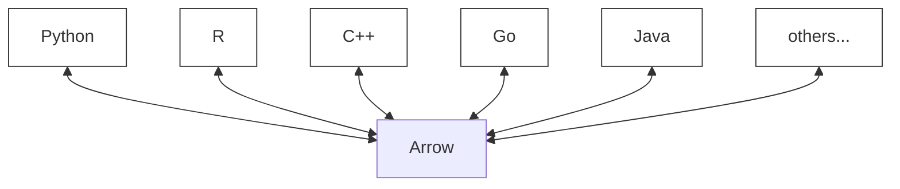
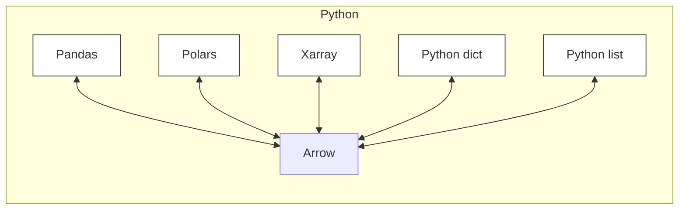
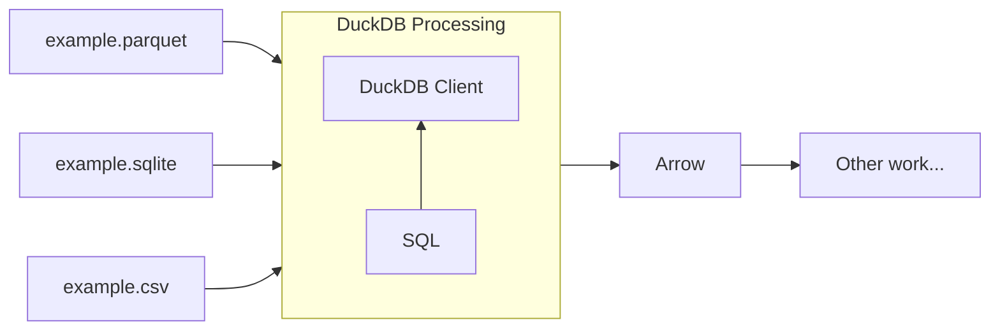

# Tip of the Week: Inter-lingual Data Engineering with Arrow and DuckDB

> Each week we seek to provide a software tip of the week geared towards helping you achieve your software goals. If you have any software questions or suggestions for an upcoming tip of the week, please don’t hesitate to reach out to #software-engineering on Slack or email DBMISoftwareEngineering at olucdenver.onmicrosoft.com

[Apache Arrow](https://arrow.apache.org/) is a language-independent and high performance data format useful in many scenarios. [DuckDB](https://duckdb.org/) is an in-process [SQL](https://en.wikipedia.org/wiki/SQL)-based data management system which is Arrow-compatible. DuckDB also provides a standardized and high performance way to work with Arrow data where otherwise one may be forced to language-specific data structures or transforms.

__TLDR (too long, didn't read);__
DuckDB may be used to access and transform Arrow-based data from multiple data formats through SQL. Using DuckDB in this way may provide improvements in performance, understandability, or long term maintainability of your code.

## Reduce Wasted Conversion Effort with Arrow

Arrow provides a [multi-language](https://arrow.apache.org/docs/) data format which prevents you from needing to convert to other formats when dealing with multiple in-memory or serialized data formats. For example, this means that a Python and an R package may use the same in-memory or file-based data without conversion (where normally a Python Pandas dataframe and R data frame may require a conversion step in between).

The same stands for various libraries within one language - Arrow enables development between various language library formats (for example, a Python Pandas dataframe and Python dictionary are two distinct in-memory formats which require a conversion in between). You can save time and effort by avoiding conversions using Arrow.

## Using SQL to Join or Transform Arrow Data via DuckDB

DuckDB provides a management client and relational database format (similar to SQLite databases) which may be handled with Arrow. SQL may be used with the DuckDB client to filter, join, or change Arrow, CSV, or Parquet data, using Arrow as a return type. Due to Arrow's cross-language properties, there is no additional cost to using SQL through DuckDB to return data for implementation within other purpose-built data formats. DuckDB provides client API's in many languages (for example, Python, R, and C++), making it possible to write DuckDB client code with SQL to manage data without having to use manually written subprocedures.

## Additional Resources

Please see the following the additional resources.
