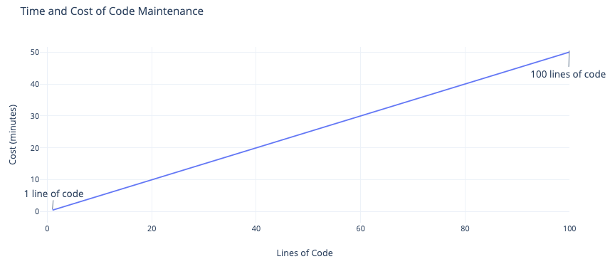

# Tip of the Week: Remove Unused Code to Avoid Software Decay

> Each week we seek to provide a software tip of the week geared towards helping you achieve your software goals. If you have any software questions or suggestions for an upcoming tip of the week, please don’t hesitate to reach out to #software-engineering on Slack or email DBMISoftwareEngineering at olucdenver.onmicrosoft.com

The act of creating software often involves many iterations of writing, personal collaborations, and testing. During this process it's common to lose awareness of code which is no longer used (and may not be tested or otherwise linted). Unused code may contribute to ["software decay"](https://en.wikipedia.org/wiki/Software_rot) (the gradual diminishment of code quality or functionality). This post will cover software decay and strategies for addressing unused code to help keep your code quality high.

__TLDR (too long, didn't read);__
Unused code is easy to amass and may cause your code quality or code functionality to diminish ("decay") over time. Effort must be taken to maintain any code or artifacts you add to your repositories, including those which are unused. Consider using [Vulture](https://github.com/jendrikseipp/vulture), [Pylint](https://pylint.pycqa.org/), or [Coverage](https://coverage.readthedocs.io/) to help illuminate sections of your code which may need to be removed.

## Code Lifecycle and Maintenance

<pre class="mermaid">
stateDiagram
    direction LR
    removal : removed or archived
    changes : changes needed
    [*] --> added
    added --> maintenance
    state maintenance {
      direction LR
      updated --> changes
      changes --> updated
    }
    maintenance --> removal
    removal --> [*]
</pre>

_Diagram showing code lifecycle activities._

Adding code to a project involves a loose agreement to maintenance for however long the code is available. The maintenance of the code can involve added efforts in changes as well as passive impacts like longer test durations or decreased readability (simply from more code).

When considering multiple parts of code in many files, this maintenance can become untenable, leading to the gradual decay of your code quality or functionality. For example, let's assume one line of code costs 30 seconds to maintain (feel free to substitute time with monetary or personnel aspects as an example measure here too). 1000 lines of code would cost about 8 hours to maintain. This becomes more complex when considering multiple files, collaborators, or languages.

<i class="fas fa-hiking" style="font-size:4em;"></i>
{:.center}

Think about your project as if it were on a hiking trail: __"Carry as little as possible, but choose that little with care."__ (Earl Shaffer). Be careful what code you choose to carry; it may impact your ability to address needs over time and lead to otherwise unintended software decay.

<i class="fas fa-hiking" style="font-size:4em;"></i>

## Detecting Unused Code

Understanding the cost of added content, it's important to routinely examine which parts of your code are still necessary. You can prepare your code for a long journey by detecting (and removing) unused code with various automated tools. These tools are generally designed for static analysis and linting, meaning they may also be incorporated into automated and routine testing.

[Vulture](https://github.com/jendrikseipp/vulture) is one tool dedicated to finding unused python code.

## Additional Resources

- [Software Rot](https://en.wikipedia.org/wiki/Software_rot)
- [Vulture](https://github.com/jendrikseipp/vulture)
- [Pylint](https://pylint.pycqa.org/en/latest/index.html)
- [Coverage](https://coverage.readthedocs.io/)
