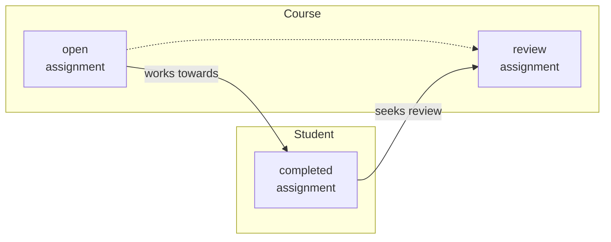
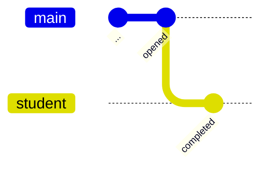
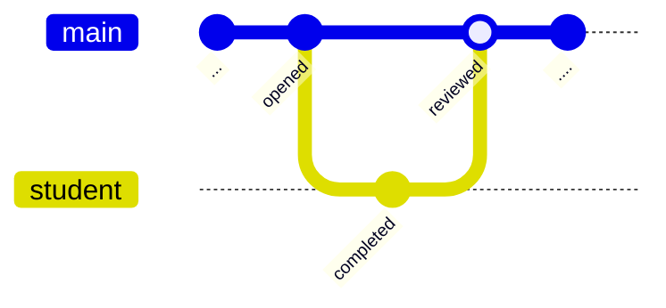

# Tip of the Week: Branch, Merge, and Learn

> Each week we seek to provide a software tip of the week geared towards helping you achieve your software goals. Views expressed in the content belong to the content creators and not the organization, its affiliates, or employees. If you have any software questions or suggestions for an upcoming tip of the week, please don’t hesitate to reach out to #software-engineering on Slack or email DBMISoftwareEngineering at olucdenver.onmicrosoft.com

__TLDR (too long, didn't read);__

## Coursework and Branches

_An example instructor and student assignment workflow._

[Git branching](https://www.atlassian.com/git/tutorials/using-branches) practices may be understood in context with similar workflows from real life. Consider a scenario within an educational course where an assignment is made available to a student. In addition to the steps above, it's important to think about _why_ this pattern is beneficial:

- Completing an assignment allows us as social, inter-dependent beings to present new findings which enable learning and amalgamation of additional ideas from others.
- On their own, our ideas without input could be interpreted as alone, disconnected, and incomplete.
- The timebound nature of assignments enables us to practice some form of [timeboxing]() so as to minimize tasks which may take too much time.

## Git Branching

_An example git diagram showing student branch being merged with main after review._

Following the course assignment workflow, the diagram above shows a `student` branch based off of the `main` branch. When the `student` branch is created, we bring into it everything we know from `main` (the course) so far in the form of [commits](https://github.com/git-guides/git-commit), or groups of changes to various files.
[Branching](https://github.com/git-guides#create-a-branch) allows us to make consistent and well described changes based on what's already happened without impacting others work in the meantime.

> ℹ️ __Quick notes on commits__: Commits on any branch represent small chunks of a cohesive idea which will eventually be brought to `main`. Keep in mind the saying _festina lente_ or __"make haste slowly"__ ([reference](https://en.wikipedia.org/wiki/Festina_lente)). In other words, it may be beneficial to be consistent with small, gradual commits to avoid rushing completion.

Reference the following commands or steps to create a git branch for your repository.

- Within the command line ([reference](https://git-scm.com/docs/git-branch)):
  1. Create the branch `git branch <branch name>`
  1. Checkout the branch to apply work to the new branch `git checkout <branch name>` (note: checkout for the branch does not occur automatically after branch creation).
- [Branching within the Github desktop application](https://docs.github.com/en/desktop/contributing-and-collaborating-using-github-desktop/making-changes-in-a-branch/managing-branches)

## Reviews and Merging

 The diagram above depicts a merge from the `student` branch to pull the changes into the `main` branch, simulating an assignment being returned for review within a course. While merges may be forced without review, it's a best practice to ask others for a [Pull Request (PR) Review](https://docs.github.com/en/pull-requests/collaborating-with-pull-requests/proposing-changes-to-your-work-with-pull-requests/creating-a-pull-request) (also known as a[Merge Request (MR)](https://docs.gitlab.com/ee/user/project/merge_requests/) on some systems). Doing this provides a chance to make revisions before code changes are "finalized" within the `main` branch.

## Resources

Please see the following the resources on this topic.

- [Atlassian: Git Branch](https://www.atlassian.com/git/tutorials/using-branches)
