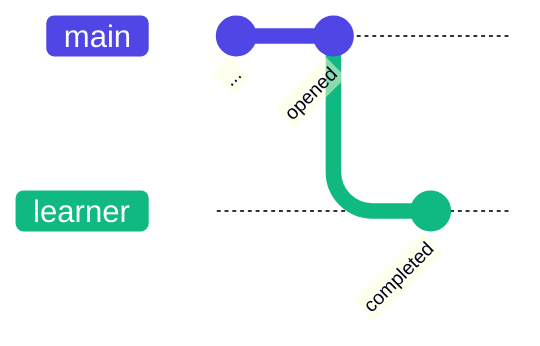
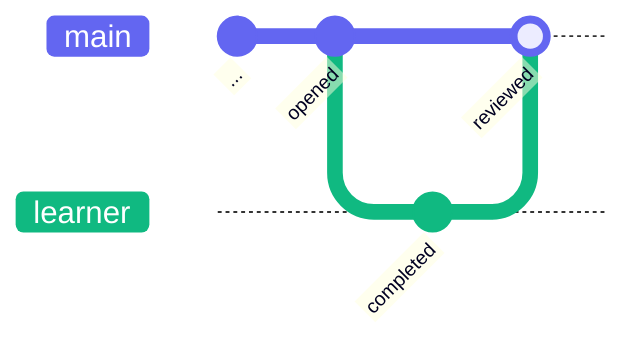
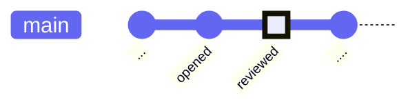

# Tip of the Week: Branch, Review, and Learn

> Each week we seek to provide a software tip of the week geared towards helping you achieve your software goals. Views expressed in the content belong to the content creators and not the organization, its affiliates, or employees. If you have any software questions or suggestions for an upcoming tip of the week, please don’t hesitate to reach out to #software-engineering on Slack or email DBMISoftwareEngineering at olucdenver.onmicrosoft.com

__TLDR (too long, didn't read);__

## Coursework and Branches


_An example course and learner assignment workflow._

[Git branching](https://www.atlassian.com/git/tutorials/using-branches) practices may be understood in context with similar workflows from real life. Consider a scenario within an educational course where an assignment is made available to a learner. In addition to the steps shown in the diagram above, it's important to think about _why_ this pattern is beneficial:

- Completing an assignment allows us as social, inter-dependent beings to present new findings which enable learning and amalgamation of additional ideas from others.
- The timebound nature of assignments enables us to practice some form of [timeboxing](https://cu-dbmi.github.io/set-website/2023/01/17/Timebox-Your-Software-Work.html) so as to minimize tasks which may take too much time.
- Segmenting applied learning in distinct, goal-orientated chunks helps make larger topics easier to understand.

## Branching to Complete an "Assignment"



_An example git diagram showing learner branch based off main._

Following the course assignment workflow, the diagram above shows an in-progress `learner` branch based off of the `main` branch. When the `learner` branch is created, we bring into it everything we know from `main` (the course) so far in the form of [commits](https://github.com/git-guides/git-commit), or groups of changes to various files. [Branching](https://github.com/git-guides#create-a-branch) allows us to make consistent and well described changes based on what's already happened without impacting others work in the meantime.

> Branching best practices:
>
> - __Keep the name and work with branches dedicated to a specific and focused purpose.__ For example: a branch named `fix-links-in-docs` might entail work related to fixing HTTP links within documentation.
> - __Consider the use of [Github Forks](https://docs.github.com/en/get-started/quickstart/fork-a-repo)__ (along with branches within the fork) to help further isolate and enrich work potential. Forks also allow remixing existing work into new possibilities.
> - __[_festina lente_](https://en.wikipedia.org/wiki/Festina_lente) or "make haste, slowly":__ Commits on any branch represent small chunks of a cohesive idea which will eventually be brought to `main`. It is often beneficial to be consistent with small, gradual commits to avoid a rushed or incomplete submission. The same applies more generally for software; taking time upfront to do things well can mean time saved later.

## Reviewing the Branch



_An example git diagram showing learner branch being merged with main after a review._

The diagram above depicts a merge from the `learner` branch to pull the changes into the `main` branch, simulating an assignment being returned for review within a course. While merges may be forced without review, it's a best practice to ask others for a [Pull Request (PR) Review](https://docs.github.com/en/pull-requests/collaborating-with-pull-requests/proposing-changes-to-your-work-with-pull-requests/creating-a-pull-request) (also known as a [Merge Request (MR)](https://docs.gitlab.com/ee/user/project/merge_requests/) on some systems). Doing this provides a chance to make revisions before code changes are "finalized" within the `main` branch.

> Github provides special tools for reviews which can assist both the author and reviewer:
>
> - __Keep code changes intended for review small__, enabling reviewers to reason through the work to more quickly provide feedback and practicing [incremental continuous improvement](https://en.wikipedia.org/wiki/Continual_improvement_process) (it may be difficult to address everything at once!). This also may denote the git history for a repository in a clearer way.
> - __Github comments:__ [Overall review comments](https://docs.github.com/en/pull-requests/collaborating-with-pull-requests/reviewing-changes-in-pull-requests/commenting-on-a-pull-request#about-pull-request-comments) (encompassing all work from the branch) and [Inline comments](https://docs.github.com/en/pull-requests/collaborating-with-pull-requests/reviewing-changes-in-pull-requests/commenting-on-a-pull-request#adding-line-comments-to-a-pull-request) (inquiring about individual lines of code) may be provided. Inline comments may also include code suggestions, which allows for code-based revision suggestions that may be committed directly to the branch using markdown codeblocks (` ```suggestion `).
> - __Github issues:__ [Creating issues from comments](https://docs.github.com/en/issues/tracking-your-work-with-issues/creating-an-issue#creating-an-issue-from-a-comment) allows the creation of new repository issues to address topics outside of the current PR.

## Merging the Branch after Review



_An example git diagram showing the main branch after the learner branch has been merged (and removed)._

Changes may be made within the `learner` branch until the work is in a state where the authors and reviewers are satisfied. At this point, the branch changes may be merged into `main`. Explicit approvals are sometimes provided to document or enable branch merge readiness (for example, [approvals within Github](https://docs.github.com/en/pull-requests/collaborating-with-pull-requests/reviewing-changes-in-pull-requests/approving-a-pull-request-with-required-reviews)). After the merge, changes may continue to be made in a similar way (perhaps accounting for concurrently branched work elsewhere).

> Github provides special tools for merging:
>
> - __Decide which merge strategy is appropriate (there are many!):__ There are many [merge strategies within Github](https://docs.github.com/en/repositories/configuring-branches-and-merges-in-your-repository/configuring-pull-request-merges/about-merge-methods-on-github) (merge commits, squash merges, and rebase merging). Take time to understand them and choose which one works best.
> - __Consider using branch protection to automate merge requirements:__ The `main` or other branches may be "protected" against merges using [branch protection rules](https://docs.github.com/en/repositories/configuring-branches-and-merges-in-your-repository/defining-the-mergeability-of-pull-requests/about-protected-branches). These rules can require reviewer approvals or automatic status checks to pass before changes may be merged.
> - __Use merge queuing to manage multiple PR's:__ When there are many unmerged PR's, it can sometimes be difficult to document and ensure each are merged in a desired sequence. Consider using [merge queues](https://docs.github.com/en/repositories/configuring-branches-and-merges-in-your-repository/configuring-pull-request-merges/managing-a-merge-queue) to help with this process.

## Resources

Please see the following the resources on this topic.

- [Atlassian: Git Branch](https://www.atlassian.com/git/tutorials/using-branches)
