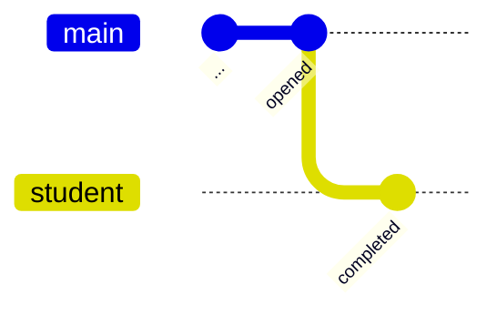
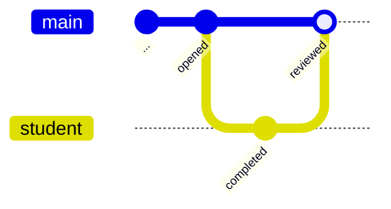
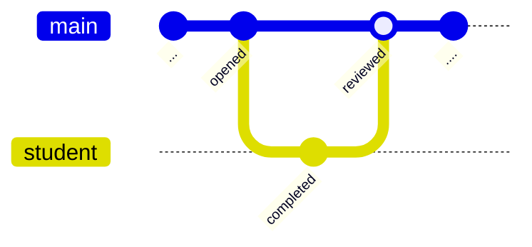
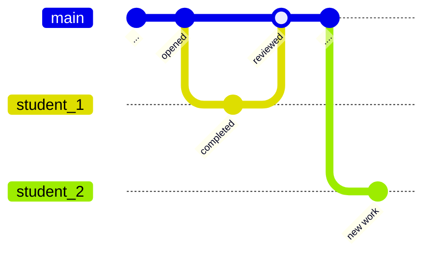

# Tip of the Week: Git Practices

> Each week we seek to provide a software tip of the week geared towards helping you achieve your software goals. Views expressed in the content belong to the content creators and not the organization, its affiliates, or employees. If you have any software questions or suggestions for an upcoming tip of the week, please don’t hesitate to reach out to #software-engineering on Slack or email DBMISoftwareEngineering at olucdenver.onmicrosoft.com

__TLDR (too long, didn't read);__

## An Example

_An example instructor and student assignment workflow._

[Git branching](https://git-scm.com/book/en/v2/Git-Branching-Basic-Branching-and-Merging) practices may be simpler to understand in context with similar workflows from real life. Consider a scenario within an educational course where an assignment is administered. The steps might look like the following:

1. Course opens an assignment for students to complete
2. A student completes the assignment
3. The student turns in their completed assignment for review or grading.

Reference the following commands or steps to create a git branch for your repository.

- Within the command line ([reference](https://git-scm.com/docs/git-branch)):
  1. Create the branch `git branch <branch name>`
  1. Checkout the branch to apply work to the new branch `git checkout <branch name>` (note: checkout for the branch does not occur automatically after branch creation).
- [Branching within the Github desktop application](https://docs.github.com/en/desktop/contributing-and-collaborating-using-github-desktop/making-changes-in-a-branch/managing-branches)

## Branching

_An example git diagram showing student branch being merged with main after review._

The course assignment workflow can help provide context with how branching may work within git. The diagram above shows a `student` branch based off of the `main` branch. The `main` branch can be thought of as the "course", or the primary place where all others collaborate. When the `student` branch is created, we bring into it everything we know from `main` (the course) so far.

## Reviewing

 After the `completed` commit takes place on the student branch, a merge is performed to pull the changes into the "main" branch.

## Merging

## Resources

Please see the following the resources on this topic.

- [Atlassian: Git Branch](https://www.atlassian.com/git/tutorials/using-branches)
