# Tip of the Week: Using Python and Anaconda with the Alpine HPC Cluster



<!-- excerpt start -->

This post is intended to help demonstrate the use of Python on [Alpine](https://curc.readthedocs.io/en/latest/clusters/alpine/index.html), a [High Performance Compute (HPC) cluster](https://en.wikipedia.org/wiki/High-performance_computing) hosted by the [University of Colorado Boulder's Research Computing](https://www.colorado.edu/rc/).
We use Python here by way of [Anaconda](https://conda.io/projects/conda/en/latest/user-guide/tasks/manage-environments.html) environment management to run code on Alpine.
This readme will cover a background on the technologies and how to use the contents of [an example project repository](https://github.com/CU-DBMI/example-hpc-alpine-python) as though it were a project you were working on and wanting to run on Alpine.

```mermaid!
flowchart LR
    subgraph repo["📦 Software repository<br/><br/>"]
        direction LR
        runscript["📄 Run script<br/><br/>"]
        subgraph condaenv["🌐 Anaconda environment<br/><br/>"]
            pythoncode["📄 Python code<br/><br/>"]
        end

    end
    subgraph alpine["🖥️ Alpine<br/><br/>"]
        subgraph spacer1[" "]
            subgraph spacer2["⚙️⚙️⚙️<br/><br/>"]
            end
        end
    end

    repo --> | process on | alpine

style condaenv fill:#FEF3C7,stroke:#D97706;
style repo fill:#ffffff,stroke:#444444;
style alpine fill:#ffffff,stroke:#444444;
style spacer1 fill:#ffffff,stroke:#ffffff;
style spacer2 fill:#ffffff,stroke:#ffffff;
```

<!-- excerpt end -->



_Diagram showing a repository's work as being processed on Alpine._

## Table of Contents

1. [__Background:__](#background) here we cover the background of Alpine and related technologies.
1. [__Implementation:__](#implementation) in this section we use the contents of [an example project repository](https://github.com/CU-DBMI/example-hpc-alpine-python) on Alpine.

## Background

### Why would I use Alpine?

```mermaid!
flowchart LR
    subgraph alpine["🖥️ Alpine<br/><br/>"]
        direction TB
        subgraph resources["💪 Compute Resources<br/><br/>"]
            check1["✅<br/><br/>"]
        end
        subgraph time["🕑 Long-running Jobs<br/><br/>"]
            check2["✅<br/><br/>"]
        end
        subgraph collaborations["👥 Collaborations<br/><br/>"]
            check3["✅<br/><br/>"]
        end
    end

style alpine fill:#ffffff,stroke:#444444;
style check1 fill:#D1FAE5,stroke:#D1FAE5;
style check2 fill:#D1FAE5,stroke:#D1FAE5;
style check3 fill:#D1FAE5,stroke:#D1FAE5;
style alpine fill:#ffffff,stroke:#444444;
```



_Diagram showing common benefits of Alpine and HPC clusters._

Alpine is a [High Performance Compute (HPC) cluster](https://en.wikipedia.org/wiki/High-performance_computing).
HPC environments provide shared computer hardware resources like [memory](https://en.wikipedia.org/wiki/Computer_memory), [CPU](https://en.wikipedia.org/wiki/Central_processing_unit), [GPU](https://en.wikipedia.org/wiki/Graphics_processing_unit) or others to run performance-intensive work.
Reasons for using Alpine might include:

- __Compute resources:__ Leveraging otherwise cost-prohibitive amounts of memory, CPU, GPU, etc. for processing data.
- __Long-running jobs:__ Completing long-running processes which may take hours or days to complete.
- __Collaborations:__ Sharing a single implementation environment for reproducibility within a group (avoiding "works on my machine" inconsistency issues).

### How does Alpine work?

```mermaid!
flowchart LR
    users["👥 Users<br/><br/>"]
    subgraph alpine["🖥️ Alpine<br/><br/>"]
        slurm["🗓️ Slurm"]
        subgraph loginnodes["🔑 Login node(s)<br/><br/>"]
            acompile["📄 acompile<br/><br/>"]
            slurmcmd["⌨️ Slurm cmd's<br/><br/>"]
        end
        subgraph computenodes["⚙️ Compute node(s)<br/><br/>"]
            hardware["⚙️ Compute\nResources<br/><br/>"]
            modules["💿 Software via\nmodules pkg<br/><br/>"]
        end
        subgraph storage["📂 Storage<br/><br/>"]
            localstorage["📁 Local Storage\n(sometimes temporary)<br/><br/>"]
        end
    end
    remotestorage["📁 External Storage\n(user specified / configured)<br/><br/>"]

    users --> |preconfigured\nSlurm access| acompile --> slurm
    users --> |direct access | slurmcmd --> slurm
    slurm --> |schedules\nshared  use of| hardware
    slurm --> |provides\naccess to| modules --> |which may\n leverage| hardware
    hardware --> |may deliver\nresults to| localstorage
    hardware --> |or deliver\nresults to| remotestorage

style alpine fill:#ffffff,stroke:#444444;
style slurm fill:#F0F9FF,stroke:#075985;
```



_Diagram showing high-level user workflow and Alpine components._

Alpine's compute resources are used through compute nodes in a system called [Slurm](https://github.com/SchedMD/slurm).
Slurm is a system that a large number of users to run jobs on a cluster of computers; the system figures out how to use all the computers in the cluster to execute all the user's jobs fairly (i.e., giving each user approximately equal time and resources on the cluster). A _job_ is a request to run something, e.g. a bash script or a program, along with specifications about how much RAM and CPU it needs, how long it can run, and how it should be executed.

Slurm's role in general is to take in a job (submitted via the `sbatch` command) and put it into a _queue_ (also called a "partition" in Slurm). For each job in the queue, Slurm constantly tries to find a computer in the cluster with enough resources to run that job, then when an available computer is found runs the program the job specifies on that computer. As the program runs, Slurm records its output to files and finally reports the program's exit status (either completed or failed) back to the job manager.

Importantly, jobs can either be marked as _interactive_ or _batch_. When you submit an interactive job, `sbatch` will pause while waiting for the job to start and then connect you to the program, so you can see its output and enter commands in real time. On the other hand, a _batch_ job will return immediately; you can see the progress of your job using `squeue`, and you can typically see the output of the job in the folder from which you ran `sbatch` unless you specify otherwise.
Data for or from Slurm work may be stored temporarily on local storage or on user-specific external (remote) storage.


__Wait, what are "nodes"?__

A simplified way to understand the architecture of Slurm on Alpine is through login and compute "nodes" (computers).
Login nodes act as a place to prepare and submit jobs which will be completed on compute nodes. Login nodes are never used to execute Slurm jobs, whereas compute nodes are exclusively accessed via a job.
Login nodes have limited resource access and are not recommended for running procedures.




One can interact with Slurm on Alpine by use of [Slurm interfaces and directives](https://curc.readthedocs.io/en/latest/clusters/alpine/examples.html).
A quick way of accessing Alpine resources is through the use of the `acompile` command, which starts an interactive job on a compute node with some typical default parameters for the job. Since `acompile` requests very modest resources (1 hour and 1 CPU core at the time of writing), you'll typically quickly be connected to a compute node. For more intensive or long-lived interactive jobs, consider using `sinteractive`, which allows for more customization: [Interactive Jobs](https://curc.readthedocs.io/en/latest/running-jobs/interactive-jobs.html).
One can also access Slurm directly through [various commands](https://slurm.schedmd.com/quickstart.html#commands) on Alpine.

Many common software packages are available through the [Modules package](https://github.com/cea-hpc/modules) on Alpine ([UCB RC documentation: The Modules System](https://curc.readthedocs.io/en/latest/compute/modules.html)).

### How does Slurm work?

```mermaid!
flowchart LR
    subgraph alpine["🖥️ Alpine<br/><br/>"]
        direction LR
        script["📄 Job script<br/><br/>"]
        subgraph slurm["🗓️ Slurm<br/><br/>"]
            queue["🕑 Queue<br/><br/>"]
            processing["⚙️ Processing<br/><br/>"]
            completion["✅ Completion\n(or cancellation)<br/><br/>"]
        end
    end

    script --> | Submit job\nto Slurm | queue
    queue --> | Scheduled job\nis processed | processing
    processing --> | Processing\ncompletes | completion
    queue --> | Cancellation without\nprocessing| completion

style alpine fill:#ffffff,stroke:#444444;
style slurm fill:#F0F9FF,stroke:#075985;
```



_Diagram showing how Slurm generally works._

Using Alpine effectively involves knowing how to leverage Slurm.
A simplified way to understand how Slurm works is through the following sequence.
Please note that some steps and additional complexity are omitted for the purposes of providing a basis of understanding.

1. __Create a job script:__ build a script which will configure and run procedures related to the work you seek to accomplish on the HPC cluster.
1. __Submit job to Slurm:__ ask Slurm to run a set of commands or procedures.
1. __Job queue:__ Slurm will queue the submitted job alongside others (recall that the HPC cluster is a shared resource), providing information about progress as time goes on.
1. __Job processing:__ Slurm will run the procedures in the job script as scheduled.
1. __Job completion or cancellation:__ submitted jobs eventually may reach completion or cancellation states with saved information inside Slurm regarding what happened.

### How do I store data on Alpine?

```mermaid!
flowchart LR
    users["👥 Users<br/><br/>"]
    subgraph alpine["🖥️ Alpine<br/><br/>"]
        slurm["🗓️ Slurm<br/><br/>"]
        processjobs["Processed jobs<br/><br/>"]
        subgraph storage["📂 Storage<br/><br/>"]
            localstorage["📁 Local Storage\n(sometimes temporary)<br/><br/>"]
        end
    end
    remotestorage["📁 External Storage\n(user specified / configured)<br/><br/>"]

    users --> |run their\nwork with| slurm
    slurm --> |runs code| processjobs
    processjobs --> |may deliver\nresults to| localstorage
    processjobs --> |or deliver\nresults to| remotestorage

style alpine fill:#ffffff,stroke:#444444;
style slurm fill:#F0F9FF,stroke:#075985;
```



Data used or produced by your processed jobs on Alpine may use a number of different data storage locations.
Be sure to follow [the Acceptable data storage and use policies of Alpine](https://curc.readthedocs.io/en/latest/additional-resources/policies.html#acceptable-data-storage-and-use), avoiding the use of certain sensitive information and other items.
These may be distinguished in two ways:

1. __Alpine local storage (sometimes temporary):__ Alpine provides a number of temporary data storage locations for accomplishing your work.
   ⚠️ _Note: some of these locations may be periodically purged and are not a suitable location for long-term data hosting ([see here for more information](https://curc.readthedocs.io/en/latest/additional-resources/policies.html#scratch-file-purge))!_<br>
   Storage locations available ([see this link for full descriptions](https://curc.readthedocs.io/en/latest/compute/filesystems.html)):

   - __Home filesystem:__ 2 GB of backed up space under `/home/$USER` (where `$USER` is your RMACC or Alpine username).
   - __Projects filesystem:__ 250 GB of backed up space under `/projects/$USER` (where `$USER` is your RMACC or Alpine username).
   - __Scratch filesystem:__ 10 TB (10,240 GB) of space __*which is not backed up*__ under `/scratch/alpine/$USER` (where `$USER` is your RMACC or Alpine username).

1. __External / remote storage:__ Users are encouraged to explore external data storage options for long-term hosting.<br>
   Examples may include the following:

   - __[PetaLibrary](https://www.colorado.edu/rc/resources/petalibrary)__: subsidized external storage host from University of Colorado Boulder's Research Computing (requires specific arrangements outside of Alpine).
   - __Cloud hosting:__ [object storage](https://en.wikipedia.org/wiki/Object_storage) and related data hosting options from cloud providers like [Microsoft Azure](https://azure.microsoft.com/en-us), [Google Cloud](https://cloud.google.com/) ([internal CU Anschutz GC information](https://www.cuanschutz.edu/offices/office-of-information-technology/tools-services/google-cloud-platform)), or [Amazon Web Services](https://aws.amazon.com/).
   - __Others:__ additional options include third-party "storage as a service" offerings like Google Drive or Dropbox and/or external servers maintained by other groups.

### How do I send or receive data on Alpine?


_Diagram showing external data storage being used to send or receive data on Alpine local storage._

Data may be sent to or gathered from Alpine using a number of different methods.
These may vary contingent on the external data storage being referenced, the code involved, or your group's available resources.
Please reference the following documentation from the University of Colorado Boulder's Research Computing regarding data transfers: [The Compute Environment - Data Transfer](https://curc.readthedocs.io/en/latest/compute/data-transfer.html).
__Please note:__ due to the authentication configuration of Alpine many local or SSH-key based methods are not available for CU Anschutz users.
As a result, [Globus](https://www.globus.org/) represents one of the best options available (see [3. 📂 Transfer data results](#3-%F0%9F%93%82-transfer-data-results) below). While the Globus tutorial in this document describes how you can download data from Alpine to your computer, note that you can also use Globus to transfer data to Alpine from your computer.

## Implementation

```mermaid!
flowchart LR
    users["(0. Gain access)\n👥 CU Anschutz\nUsers<br/><br/>"]
    subgraph alpine["🖥️ Alpine<br/><br/>"]
        direction LR
        alpineterminal1["(1. Prepare code)\n⌨️ git clone<br/><br/>"]
        alpineterminal2["(2. Implement code)\n⌨️ Process run script<br/><br/>"]
        subgraph repo["📦 This repo<br/><br/>"]
            direction TB
            runscript["📄 Run script<br/><br/>"]
            subgraph condaenv["🌐 Anaconda environment<br/><br/>"]
                pythoncode["📄 Python code<br/><br/>"]
            end
        end
        subgraph slurmjob["🗓️ Slurm processing<br/><br/>"]
            direction LR
            processing["⚙️ Processing<br/><br/>"]
        end
        subgraph storage["📂 Storage<br/><br/>"]
            localstorage["(3. Gather data)\n📁 Local Storage\n(sometimes temporary)<br/><br/>"]
        end
    end

    users --> | gain access\nvia RMACC acct.| alpineterminal1
    alpineterminal1 --> | bring repo\n contents to Alpine | repo
    runscript --> |run\nscript file| alpineterminal2
    alpineterminal2 --> |submit\nSlurm job| processing
    processing --> | completed job\n sends data to| localstorage
    pythoncode -.-> | run python code\nwithin conda env |processing

style condaenv fill:#FEF3C7,stroke:#D97706;
style repo fill:#ffffff,stroke:#444444;
style alpine fill:#ffffff,stroke:#444444;
style users fill:#D1FAE5,stroke:#444444;
style alpineterminal1 fill:#D1FAE5,stroke:#444444;
style alpineterminal2 fill:#D1FAE5,stroke:#444444;
style localstorage fill:#D1FAE5,stroke:#444444;
```



_Diagram showing how [an example project repository](https://github.com/CU-DBMI/example-hpc-alpine-python) may be used within Alpine through primary steps and processing workflow._

Use the following steps to understand how Alpine may be used with [an example project repository](https://github.com/CU-DBMI/example-hpc-alpine-python) to run example Python code.

### 0. 🔑 Gain Alpine access

First you will need to gain access to Alpine.
This access is provided to members of the University of Colorado Anschutz through [RMACC](https://rmacc.org/) and is separate from other credentials which may be provided by default in your role.
Please see the following guide from the University of Colorado Boulder's Research Computing covering requesting access and generally how this works for members of the University of Colorado Anschutz.

- __RMACC Access to Alpine:__ [https://curc.readthedocs.io/en/latest/access/rmacc.html](https://curc.readthedocs.io/en/latest/access/rmacc.html)

### 1. 🛠️ Prepare code on Alpine

```shell
[username@xsede.org@login-ciX ~]$ cd /projects/$USER
[username@xsede.org@login-ciX username@xsede.org]$ git clone https://github.com/CU-DBMI/example-hpc-alpine-python
Cloning into 'example-hpc-alpine-python'...
... git output ...
[username@xsede.org@login-ciX username@xsede.org]$ ls -l example-hpc-alpine-python
... ls output ...
```

_An example of what this preparation section might look like in your Alpine terminal session._

Next we will prepare our code within Alpine.
We do this to balance the fact that we may develop and source control code outside of Alpine.
In the case of this example work, we assume git as an interface for GitHub as the source control host.

Below you'll find the general steps associated with this process.

1. Login to the Alpine command line ([reference this guide](https://curc.readthedocs.io/en/latest/access/rmacc.html#logging-in-to-open-ondemand)).
1. Change directory into the __Projects filesystem__ (generally we'll assume processed data produced by this code are large enough to warrant the need for additional space):<br> `cd /projects/$USER`
1. Use `git` (built into Alpine by default) commands to clone this repo:<br> `git clone https://github.com/CU-DBMI/example-hpc-alpine-python`
1. Verify the contents were received as desired (this should show the contents of [an example project repository](https://github.com/CU-DBMI/example-hpc-alpine-python)):<br> `ls -l example-hpc-alpine-python`

<!--- anchor for referencing github authentication guidance directly --->

<a id="prepare-code-authenticate"></a>


__What if I need to authenticate with GitHub?__

There are times where you may need to authenticate with GitHub in order to accomplish your work.
From a GitHub perspective, you will want to use either GitHub Personal Access Tokens (PAT) (recommended by GitHub) or SSH keys associated with the `git` client on Alpine.
Note: if you are prompted for a username and password from `git` when accessing a GitHub resource, the password is now associated with other keys like PAT's instead of your user's password ([reference](https://github.blog/changelog/2021-08-12-git-password-authentication-is-shutting-down)).
See the following guide from GitHub for more information on how authentication through `git` to GitHub works:

- __GitHub - Authenticating with GitHub from Git:__ [https://docs.github.com/en/get-started/quickstart/set-up-git#authenticating-with-github-from-git](https://docs.github.com/en/get-started/quickstart/set-up-git#authenticating-with-github-from-git)




### 2. ⚙️ Implement code on Alpine

```shell
[username@xsede.org@login-ciX ~]$ sbatch --export=CSV_FILEPATH="/projects/$USER/example_data.csv" example-hpc-alpine-python/run_script.sh
[username@xsede.org@login-ciX username@xsede.org]$ tail -f example-hpc-alpine-python.out
... tail output (ctrl/cmd + c to cancel) ...
[username@xsede.org@login-ciX username@xsede.org]$ head -n 2 example_data.csvexample-hpc-alpine-python
... data output ...
```

_An example of what this implementation section might look like in your Alpine terminal session._

After our code is available on Alpine we're ready to run it using Slurm and related resources.
We use Anaconda to build a Python environment with specified packages for reproducibility.
The main goal of the Python code related to this work is to create a CSV file with random data at a specified location.
We'll use [Slurm's `sbatch` command](https://slurm.schedmd.com/sbatch.html), which submits batch scripts to Slurm using various options.

1. Use the `sbatch` command with exported variable `CSV_FILEPATH`.<br> `sbatch --export=CSV_FILEPATH="/projects/$USER/example_data.csv" example-hpc-alpine-python/run_script.sh`
1. After a short moment, use the [`tail`](<https://en.wikipedia.org/wiki/Tail_(Unix)>) command to observe the log file created by Slurm for this sbatch submission. This file can help you understand where things are at and if anything went wrong.<br> `tail -f example-hpc-alpine-python.out`
1. Once you see that the work has completed from the log file, take a look at the top 2 lines of the data file using the [`head`](<https://en.wikipedia.org/wiki/Head_(Unix)>) command to verify the data arrived as expected (column names with random values):<br> `head -n 2 example_data.csv`

### 3. 📂 Transfer data results

```mermaid!
flowchart LR
    subgraph alpine["🖥️ Alpine<br/><br/>"]
        localstorage["📄 /projects/$USER/example_data.csv<br/><br/>"]
    end
    subgraph globus["☁️ Globus<br/><br/>"]
        globusweb["🔁 Globus web interface<br/><br/>"]
    end
    subgraph localmachine["🖥️ Local device<br/><br/>"]
        personalconnect["🔁 Globus Connect Personal<br/><br/>"]
        localdir["📄 /a_local_dir/example_data.csv<br/><br/>"]
    end

    localstorage --> | moves data\nfrom Alpine | globusweb
    globusweb --> | interface \n from Globus | personalconnect
    personalconnect --> | downloads \n local file | localdir

style alpine fill:#ffffff,stroke:#444444;
style globus fill:#ffffff,stroke:#444444;
style localmachine fill:#ffffff,stroke:#444444;
```



_Diagram showing how example_data.csv may be transferred from Alpine to a local machine using Globus solutions._

Now that the example data output from the Slurm work is available we need to transfer that data to a local system for further use.
In this example we'll use [Globus](https://www.globus.org/) as a data transfer method from Alpine to our local machine.
__Please note:__ always be sure to check data privacy and policy which change the methods or storage locations you may use for your data!

1. __Globus local machine configuration__
   1. Install [Globus Connect Personal](https://www.globus.org/globus-connect-personal) on your local machine.
   1. During installation, you will be prompted to login to Globus. Use your ACCESS credentials to login.
   1. During installation login, note the label you provide to Globus. This will be used later, referenced as "Globus Connect Personal label".
   1. Ensure you add and (__importantly:__) provide write access to a local directory via __Globus Connect Personal - Preferences - Access__ where you'd like the data to be received from Alpine to your local machine.<br><br>
1. __Globus web interface__
   1. Use your ACCESS credentials to login to the [Globus web interface](https://app.globus.org/login).
   1. __Configure File Manager <ins>left</ins> side (source selection)__
      1. Within the Globus web interface on the File Manager tab, use the __Collection__ input box to search or select __"CU Boulder Research Computing ACCESS"__.
      1. Within the Globus web interface on the File Manager tab, use the __Path__ input box to enter: `/projects/your_username_here/` (replacing "your_username_here" with your username from Alpine, including the "@" symbol if it applies).
   1. __Configure File Manager <ins>right</ins> side (destination selection)__
      1. Within the Globus web interface on the File Manager tab, use the __Collection__ input box to search or select the \_\_Globus Connect Personal label you provided in earlier steps.
      1. Within the Globus web interface on the File Manager tab, use the __Path__ input box to enter the local path which you made accessible in earlier steps.
   1. __Begin Globus transfer__
      1. Within the Globus web interface on the File Manager tab on the left side (source selection), check the box next to the file `example_data.csv`.
      1. Within the Globus web interface on the File Manager tab on the left side (source selection), click the "Start ▶️" button to begin the transfer from Alpine to your local directory.
      1. After clicking the "Start ▶️" button, you may see a message in the top right with the message "Transfer request submitted successfully". You can click the link to view the details associated with the transfer.
      1. After a short period, the file will be transferred and you should be able to verify the contents on your local machine.

## Further References

- [University of Colorado Boulder's Research Computing](https://www.colorado.edu/rc/)
- [HPC Cluster Alpine Documentation](https://curc.readthedocs.io/en/latest/clusters/alpine/index.html)
- [GitHub: Getting started with Git](https://docs.github.com/en/get-started/getting-started-with-git)
- [Slurm Documentation](https://slurm.schedmd.com/)
- [Globus Documentation](https://docs.globus.org/)
