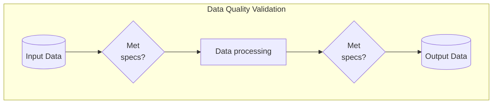
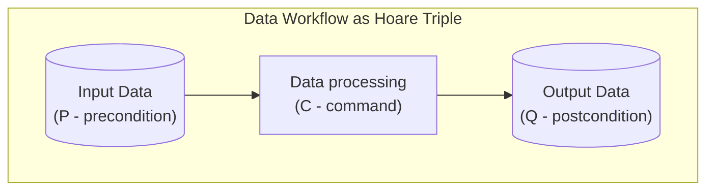
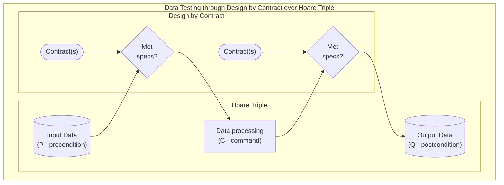
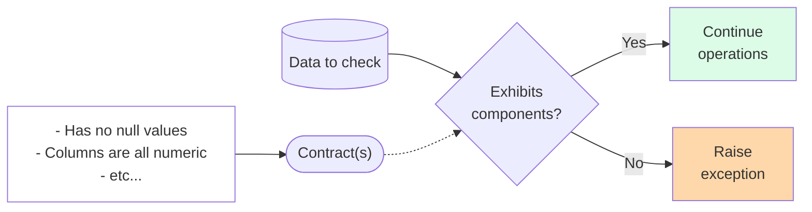
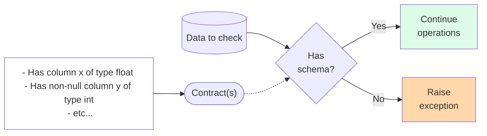
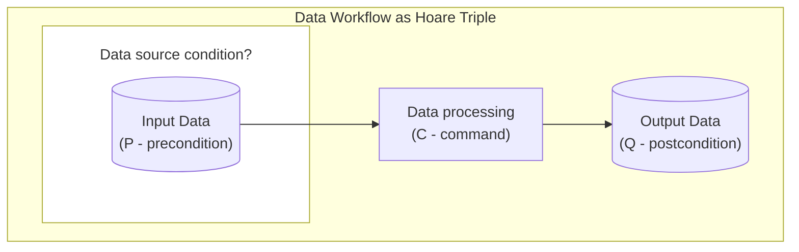
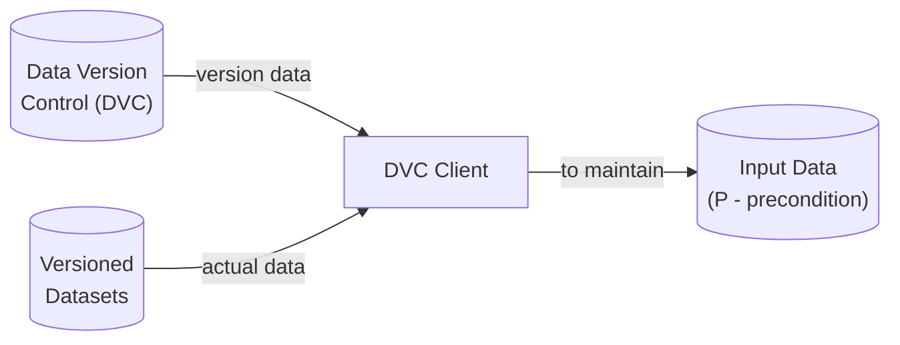
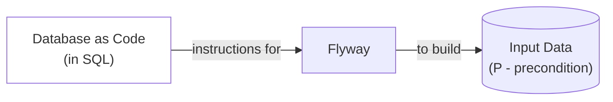

# Tip of the Week: Data Quality Validation through Software Testing Techniques



__TLDR (too long, didn't read);__

Implement data quality validation through [software testing](https://en.wikipedia.org/wiki/Software_testing) approaches which leverage ideas surrounding [Hoare triples](https://en.wikipedia.org/wiki/Hoare_logic#Hoare_triple) and [Design by contract (DbC)](https://en.wikipedia.org/wiki/Design_by_contract). Balancing reusability through [component-based design](https://en.wikipedia.org/wiki/Component-based_software_engineering) data testing with [Great Expectations](https://github.com/great-expectations/great_expectations) or [Assertr](https://github.com/ropensci/assertr/). For greater specificity in your data testing, use [database schema-like](https://en.wikipedia.org/wiki/Database_schema) verification through [Pandera](https://pandera.readthedocs.io/en/stable/index.html) or a [JSON Schema](https://json-schema.org/learn/getting-started-step-by-step) validator. When possible, practice [shift-left testing](https://en.wikipedia.org/wiki/Shift-left_testing) on data sources by through the concept of ["database(s) as code"](https://speakerdeck.com/tastapod/arent-we-forgetting-someone) via tools like [Data Version Control (DVC)](https://dvc.org/doc) and [Flyway](https://github.com/flyway/flyway).

## Introduction



_Diagram showing input, in-process data, and output data as a workflow._

<!-- excerpt start -->
Data orientated software development can benefit from a specialized focus on varying aspects of data quality validation.
We can use [software testing](https://en.wikipedia.org/wiki/Software_testing) techniques to validate certain qualities of the data in order to meet a declarative standard (where one doesn't need to guess or rediscover known issues).
These come in a number of forms and generally follow existing software testing concepts which we'll expand upon below.
This article will cover a few tools which leverage these techniques for addressing data quality validation testing.
<!-- excerpt end -->
## Data Quality Testing Concepts

### Hoare Triple



One concept we'll use to present these ideas is [_Hoare logic_](https://en.wikipedia.org/wiki/Hoare_logic), which is a system for reasoning on [software correctness](https://en.wikipedia.org/wiki/Correctness_(computer_science)).
Hoare logic includes the idea of a [Hoare triple](https://en.wikipedia.org/wiki/Hoare_logic#Hoare_triple) ($ {\displaystyle \{P\}C\{Q\}} $) where $ {\displaystyle \{P\}} $ is an assertion of precondition, $ {\displaystyle \ C} $ is a command, and $ {\displaystyle \{Q\}} $ is a postcondition assertion.
Software development using data often entails (sometimes assumed) assertions of precondition from data sources, a transformation or command which changes the data, and a (sometimes assumed) assertion of postcondition in a data output or result.

### Design by Contract



_Data testing through design by contract over Hoare triple._

Hoare logic and Software correctness help describe [design by contract (DbC)](https://en.wikipedia.org/wiki/Design_by_contract), a software approach involving the formal specification of "contracts" which help ensure we meet our intended goals.
DbC helps describe how to create assertions when proceeding through Hoare triplet states for data.
These concepts provide a framework for thinking about the tools mentioned below.

## Data Component Testing



_Diagram showing data contracts as __generalized and reusable "component" testing__ being checked through contracts and raising an error if they aren't met or continuing operations if they are met._

We often need to verify a certain component's surrounding data in order to ensure it meets minimum standards.
The word "component" is used here from the context of [component-based software design](https://en.wikipedia.org/wiki/Component-based_software_engineering) to group together reusable, modular qualities of the data where sometimes we don't know (or want) to specify granular aspects (such as schema, type, column name, etc).
These components often are implied by software which will eventually use the data, which can emit warnings or errors when they find the data does not meet these standards.
Oftentimes these components are contracts checking postconditions of earlier commands or procedures, ensuring the data we receive is accurate to our intention.
___We can avoid these challenges by creating contracts for our data to verify the components of the result before it reaches later stages.___

Examples of these data components might include:

- The dataset has no null values.
- The dataset has no more than 3 columns.
- The dataset has a column called `numbers` which includes numbers in the range of 0-10.

### Data Component Testing - Great Expectations

```python
"""
Example of using Great Expectations
Referenced with modifications from: 
https://docs.greatexpectations.io/docs/tutorials/quickstart/
"""
import great_expectations as gx

# get gx DataContext
# see: https://docs.greatexpectations.io/docs/terms/data_context
context = gx.get_context()

# set a context data source 
# see: https://docs.greatexpectations.io/docs/terms/datasource
validator = context.sources.pandas_default.read_csv(
    "https://raw.githubusercontent.com/great-expectations/gx_tutorials/main/data/yellow_tripdata_sample_2019-01.csv"
)

# add and save expectations 
# see: https://docs.greatexpectations.io/docs/terms/expectation
validator.expect_column_values_to_not_be_null("pickup_datetime")
validator.expect_column_values_to_be_between("passenger_count", auto=True)
validator.save_expectation_suite()

# checkpoint the context with the validator
# see: https://docs.greatexpectations.io/docs/terms/checkpoint
checkpoint = context.add_or_update_checkpoint(
    name="my_quickstart_checkpoint",
    validator=validator,
)

# gather checkpoint expectation results
checkpoint_result = checkpoint.run()

# show the checkpoint expectation results
context.view_validation_result(checkpoint_result)
```

_Example code leveraging Python package Great Expectations to perform various data component contract validation._

[Great Expectations](https://github.com/great-expectations/great_expectations) is a Python project which provides data  contract testing features through the use of component called ["expectations"](https://greatexpectations.io/expectations/) about the data involved.
These expectations act as a standardized way to define and validate the component of the data in the same way across different datasets or projects.
In addition to providing a mechanism for validating data contracts, Great Expecations also provides a way to [view validation results](https://docs.greatexpectations.io/docs/guides/setup/configuring_metadata_stores/configure_result_stores), [share expectations](https://docs.greatexpectations.io/docs/guides/setup/configuring_metadata_stores/configure_expectation_stores), and also [build data documentation](https://docs.greatexpectations.io/docs/guides/setup/configuring_data_docs/host_and_share_data_docs).
See the above example for a quick code reference of how these work.

### Data Component Testing - Assertr

```R
# Example using the Assertr package
# referenced with modifications from:
# https://docs.ropensci.org/assertr/articles/assertr.html
library(dplyr)
library(assertr)

# set our.data to reference the mtcars dataset
our.data <- mtcars

# simulate an issue in the data for contract specification
our.data$mpg[5] <- our.data$mpg[5] * -1

# use verify to validate that column mpg >= 0
our.data %>%
  verify(mpg >= 0)

# use assert to validate that column mpg is within the bounds of 0 to infinity
our.data %>%
  assert(within_bounds(0,Inf), mpg)
```

_Example code leveraging R package Assertr to perform various data component contract validation._

[Assertr](https://github.com/ropensci/assertr/) is an R project which provides similar data component assertions in the form of verify, assert, and insist methods ([see here for more documentation](https://docs.ropensci.org/assertr/articles/assertr.html)).
Using Assertr enables a similar but more lightweight functionality to that of Great Expectations.
See the above for an example of how to use it in your projects.

## Data Schema Testing



_Diagram showing data contracts as __more granular specifications via "schema" testing__ being checked through contracts and raising an error if they aren't met or continuing operations if they are met._

Sometimes we need greater specificity than what a data component can offer.
We can use data schema testing contracts in these cases.
The word "schema" here is used from the context of [database schema](https://en.wikipedia.org/wiki/Database_schema), but oftentimes these specifications are suitable well beyond solely databases (including database-like formats like dataframes).
While reuse and modularity are more limited with these cases, they can be helpful for efforts where precision is valued or necessary to accomplish your goals.
It's worth mentioning that data schema and component testing tools often have many overlaps (meaning you can interchangeably use them to accomplish both tasks).

### Data Schema Testing - Pandera

```python
"""
Example of using the Pandera package
referenced with modifications from:
https://pandera.readthedocs.io/en/stable/try_pandera.html
"""
import pandas as pd
import pandera as pa
from pandera.typing import DataFrame, Series


# define a schema
class Schema(pa.DataFrameModel):
    item: Series[str] = pa.Field(isin=["apple", "orange"], coerce=True)
    price: Series[float] = pa.Field(gt=0, coerce=True)


# simulate invalid dataframe
invalid_data = pd.DataFrame.from_records(
    [{"item": "applee", "price": 0.5}, 
     {"item": "orange", "price": -1000}]
)


# set a decorator on a function which will
# check the schema as a precondition
@pa.check_types(lazy=True)
def precondition_transform_data(data: DataFrame[Schema]):
    print("here")
    return data


# precondition schema testing
try:
    precondition_transform_data(invalid_data)
except pa.errors.SchemaErrors as schema_excs:
    print(schema_excs)

# inline or implied postcondition schema testing
try:
    Schema.validate(invalid_data)
except pa.errors.SchemaError as schema_exc:
    print(schema_exc)
```

_Example code leveraging Python package Pandera to perform various data schema contract validation._

DataFrame-like libraries like [Pandas](https://pandas.pydata.org/) can verified using schema specification contracts through [Pandera](https://pandera.readthedocs.io/en/stable/index.html) (see here for [full DataFrame library support](https://pandera.readthedocs.io/en/stable/supported_libraries.html#supported-dataframe-libraries)).
Pandera helps define specific columns, column types, and also has some component-like features.
It leverages a Pythonic class specification, similar to [data classes](https://docs.python.org/3/library/dataclasses.html) and [pydantic models](https://docs.pydantic.dev/latest/concepts/models/), making it potentially easier to use if you already understand Python and DataFrame-like libraries.
See the above example for a look into how Pandera may be used.

### Data Schema Testing - JSON Schema

```R
# Example of using the jsonvalidate R package.
# Referenced with modifications from:
# https://docs.ropensci.org/jsonvalidate/articles/jsonvalidate.html

schema <- '{
  "$schema": "https://json-schema.org/draft/2020-12/schema",
  "title": "Hello World JSON Schema",
  "description": "An example",
  "type": "object",
  "properties": {
    "hello": {
      "description": "Provide a description of the property here",
      "type": "string"
    }
  },
  "required": [
    "hello"
  ]
}'

# create a schema contract for data
validate <- jsonvalidate::json_validator(schema, engine = "ajv")

# validate JSON using schema specification contract and invalid data
validate("{}")

# validate JSON using schema specification contract and valid data
validate("{'hello':'world'}")
```

[JSON Schema](https://json-schema.org/learn/getting-started-step-by-step) provides a vocabulary way to validate schema contracts for JSON documents.
There are several implementations of the vocabulary, including [Python package jsonschema](https://github.com/python-jsonschema/jsonschema), and R package [jsonvalidate](https://github.com/ropensci/jsonvalidate).
Using these libraries allows you to define pre- or postcondition data schema contracts for your software work.
See above for an R based example of using this vocabulary to perform data schema testing.

## Shift-left Data Testing



Earlier portions of this article have covered primarily data validation of command side-effects and postconditions.
This is commonplace in development where data sources usually are provided without the ability to validate their precondition or definition.
[Shift-left testing](https://en.wikipedia.org/wiki/Shift-left_testing) is a movement which focuses on validating earlier in the lifecycle if and when possible to avoid downstream issues which might occur.

### Shift-left Data Testing - Data Version Control (DVC)



Data sources undergoing frequent changes become difficult to use because we oftentimes don't know _when_ the data is from or what version it might be.
This information is sometimes added in the form of filename additions or an update datetime column in a table.
[Data Version Control (DVC)](https://dvc.org/doc) is one tool which is specially purposed to address this challenge through [source control](https://en.wikipedia.org/wiki/Version_control) techniques.
Data managed by DVC allows software to be built in such a way that version preconditions are validated before reaching data transformations (commands) or postconditions.

### Shift-left Data Testing - Flyway



Database sources can leverage an idea nicknamed ["database as code"](https://speakerdeck.com/tastapod/arent-we-forgetting-someone) (which builds on a similar idea about [infrastructure as code](https://en.wikipedia.org/wiki/Infrastructure_as_code)) to help declare the schema and other elements of a database in the same way one would code.
These ideas apply to both databases and also more broadly through DVC mentioned above (among other tools) via the concept ["data as code"](https://en.wikipedia.org/wiki/Code_as_data).
Implementing this idea has several advantages from source versioning, visibility, and replicability.
One tool which implements these ideas is [Flyway](https://github.com/flyway/flyway) which can manage and implement SQL-based files as part of software data precondition validation.
A lightweight alternative to using Flyway is sometimes to include a SQL file which creates related database objects and becomes data documentation.
