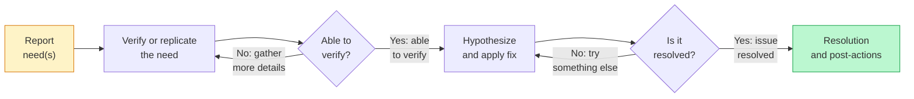
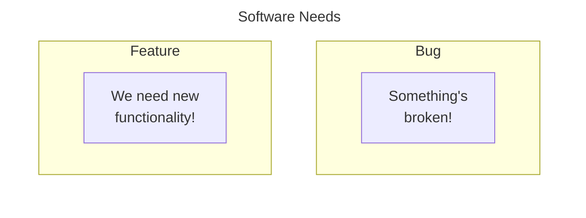

# Tip of the Week: Codesgiving - Open-source Contribution Walkthrough



## Introduction



<!-- excerpt start -->
[Thanksgiving](https://en.wikipedia.org/wiki/Thanksgiving) is a holiday practiced in many countries which focuses on gratitude for good harvests of the preceding year.
In the United States, we celebrate Thanksgiving on the fourth Thursday of November each year often by eating meals we create together with others.
This post channels the spirit of Thanksgiving by _giving_ our thanks through _code_ as a ___"Codesgiving"___,  acknowledging and creating better software together.
<!-- excerpt end -->

## Giving Thanks to Open-source Harvests

<i class="fas fa-handshake-angle" style="font-size:4em;"></i>
{:.center}

Part of building software involves the use of code which others have built, maintained, and distributed for a wider audience.
Using other people's work often comes in the form of [open-source](https://en.wikipedia.org/wiki/Open_source) "harvesting" as we find solutions to software challenges we face.
Examples might include installing and depending upon Python packages from [PyPI](https://en.wikipedia.org/wiki/Python_Package_Index) or R packages from [CRAN](https://en.wikipedia.org/wiki/R_package#Comprehensive_R_Archive_Network_(CRAN)) within your software projects.

> "Real generosity toward the future lies in giving all to the present."
> \- Albert Camus

These open-source projects have internal costs which are sometimes invisible to those who consume them.
Every software project has an implied level of [software gardening](https://bssw.io/blog_posts/long-term-software-gardening-strategies-for-cultivating-scientific-development-ecosystems) time costs involved to impede decay, practice continuous improvements, and evolve the work.
One way to actively share our thanks for the projects we depend on is through applying our time towards code contributions on them.

Many projects are in need of additional people's thinking and development time.
Have you ever noticed something that needs to be fixed or desirable functionality in a project you use?
___Consider adding your contributions to open-source!___

## All Contributions Matter

<i class="fas fa-hands-holding-circle" style="font-size:4em;"></i>
{:.center}

Contributing to open-source can come in many forms and contributions don't need to be gigantic to make an impact.
Software often involves simplifying complexity.
Simplification requires many actions beyond solely writing code.
For example, a short walk outside, a conversation with someone, or a nap can sometimes help us with breakthroughs when it comes to development.
By the same token, open-source benefits greatly from communications on discussion boards, bug or feature descriptions, or other work that might not be strictly considered "engineering".

## An Open-source Contribution Approach



_The troubleshooting process as a workflow involving looped checks for verifying an issue and validating the solution fixes an issue._

It can feel overwhelming to find a way to contribute to open-source.
Similar to other software methodology, modularizing your approach can help you progress without being overwhelmed.
Using a troubleshooting approach like the above can help you break down big challenges into bite-sized chunks.
Consider each step as a "module" or "section" which needs to be addressed sequentially.

### Embrace a Learning Mindset

> "Before you speak ask yourself if what you are going to say __is true, is kind, is necessary, is helpful__. If the answer is no, maybe what you are about to say should be left unsaid."
> \- Bernard Meltzer

Open-source contributions almost always entail learning of some kind.
Many contributions happen solely in the form of code and text communications which are easily misinterpreted.
__Assume positive intent__ and accept input from others while upholding your own ideas to share successful contributions together.
Prepare yourself by intentionally opening your mind to input from others, even if you're sure you're absolutely "right".



Before communicating, be sure to use Bernard Meltzer's self-checks mentioned above.

1. Is what I'm about to say __true__?
    - Have I taken time to verify the claims in a way others can replicate or understand?
2. Is what I'm about to say __kind__?
    - Does my intention and communication channel kindness (and not cruelty)?
3. Is what I'm about to say __necessary__?
    - Do my words and actions here enable or enhance progress towards a goal (would the outcome be achieved without them)?
4. Is what I'm about to say __helpful__?
    - How does my communication increase the quality or sustainability of the project (or group)?




### Setting Software Scheduling Expectations

<script src="https://cdn.jsdelivr.net/npm/vega@5.22.1"></script>
<script src="https://cdn.jsdelivr.net/npm/vega-lite@5.6.0"></script>
<script src="https://cdn.jsdelivr.net/npm/vega-embed@6.21.0"></script>
<div id="vis"></div>

<script>
  var spec = {
    "$schema": "https://vega.github.io/schema/vega-lite/v5.json",
    "description": "Suggested Open-source Time Allocations",
    "width": 500,
    "height": 300,
    "title":"Suggested Open-source Time Allocations",
    "data": {
      "values": [
        {"task": "1. Planning", "percentage": 33},
        {"task": "2. Coding", "percentage": 16},
        {"task": "3. Component and System Testing", "percentage": 25},
        {"task": "4. Code Review, Revisions, and Post-Actions", "percentage": 25}
      ]
    },
    "mark": {"type": "arc", "tooltip": true},
    "encoding": {
      "color": {"field": "task", "type": "nominal", "title": "Task", "sort":"ascending"},
      "theta": {"field": "percentage", "type": "quantitative", "title": "Percentage"}
    },
    "config": {
      "legend": {
        "orient": "right",
        "labelLimit": 500
      }
    }
  };

  const embed_opt = {"mode": "vega-lite"};
  const el = document.getElementById('vis');
  const view = vegaEmbed("#vis", spec, embed_opt);
</script>
_Suggested ratio of time spent by type of work for an open-source contribution._
{:.center}

1. 1/3 planning (~33%)
2. 1/6 coding (~16%)
3. 1/4 component and system testing (25%)
4. 1/4 code review, revisions, and post-actions (25%)

This modified rule of thumb from [_The Mythical Man Month_](https://www.oreilly.com/library/view/mythical-man-month-the/0201835959/) can assist with how you structure your time for an open-source contribution.
Notice the emphasis on planning and testing and keep these in mind as you progress (the actual programming time can be small if adequate time has been spent on planning).
Notably, the original time fractions are modified here with the final quarter of the time spent suggested as code review, revisions, and post-actions.
Planning for the time expense of the added code review and related elements assists with keeping a learning mindset throughout the process (instead of feeling like the review is a "tack-on" or "optional / supplementary").
A good motto to keep in mind throughout this process is [_Festina lente_](https://en.wikipedia.org/wiki/Festina_lente), or __"Make haste, slowly."__ (take care to move thoughtfully and as slowly as necessary to do things correctly the first time).


## Planning an Open-source Contribution

### Has the Need Already Been Reported?

<i class="fas fa-comments" style="font-size:4em;"></i>
{:.center}

Be sure to check whether the bug or feature has already been reported somewhere!
In a way, this is a practice of ["Don't repeat yourself" (DRY)](https://en.wikipedia.org/wiki/Don%27t_repeat_yourself) where we attempt to avoid repeating the same block of code (in this case, the "code" can be understood as natural language).
For example, you can look on GitHub Issues or GitHub Discussions with a search query matching the rough idea of what you're thinking about.
You can also use the GitHub search bar to automatically search multiple areas (including Issues, Discussions, Pull Requests, etc.) when you enter a query from the repository homepage.
If it has been reported already, take a look to see if someone has made a code contribution related to the work already.

An open discussion or report of the need doesn't guarantee someone's already working on a solution.
If there aren't yet any code contributions and it doesn't look like anyone is working on one, consider volunteering to take a further look into the solution and be sure to acknowledge any existing discussions.
If you're unsure, it's always kind to mention your interest in the report and ask for more information.

### Is the Need a Bug or Feature?

<!-- set a max width for mermaid diagram below so it doesn't render so large -->
<style>
#feature-or-bug img { max-width: 500px; }
</style>

<div id="feature-or-bug">



</div>

One way to help solidify your thinking and the approach is to consider whether what you're proposing is a bug or a feature.
A [software bug](https://en.wikipedia.org/wiki/Software_bug) is considered something which is broken or malfunctioning.
A [software feature](https://en.wikipedia.org/wiki/Software_feature) is generally considered new functionality or a different way of doing things than what exists today.
There's often overlap between these, and sometimes they can inspire branching needs, but individually they usually are more of one than the other.
If you can't decide whether your need is a bug or a feature, consider breaking it down into smaller sub-components so they can be more of one or the other.
Following this strategy will help you communicate the potential for contribution and also clarify the development process (for example, a critical bug might be prioritized differently than a nice-to-have new feature).

### Reporting the Need for Change

```markdown
# Using `function_x` with `library_y` causes `exception_z`

## Summary

As a `library_y` research software developer I want to use `function_x` 
for my data so that I can share data for research outcomes.

## Reproducing the error

This error may be seen using Python v3.x on all major OS's using
the following code snippet:
...

```

_An example of a user story issue report with imagined code example._

Open-source needs are often best reported through written stories captured within a bug or feature tracking system (such as [GitHub Issues](https://github.com/features/issues)) which if possible also include example code or logs.
One template for reporting issues is through a "user story".
A user story typically comes in the form: `As a < type of user >, I want < some goal > so that < some reason >.` ([Mountain Goat Software: User Stories](https://www.mountaingoatsoftware.com/agile/user-stories)).
Alongside the story, it can help to add in a snippet of code which exemplifies a problem, new functionality, or a potential adjacent / similar solution.
As a general principle, __be as specific as you can without going overboard__.
Include things like programming language version, operating system, and other system dependencies that might be related.

Once you have a good written description of the need, be sure to submit it where it can be seen by the relevant development community.
For GitHub-based work, this is usually a GitHub Issue, but can also entail discussion board posts to gather buy-in or consensus before proceeding.
In addition to the specifics outlined above, also recall the [learning mindset and Bernard Meltzer's self-checks](#embrace-a-learning-mindset), taking time to acknowledge especially the potential challenges and already attempted solutions associated with the description (conveying kindness throughout).

### What Happens After You Submit a Bug or Feature Report?


<i class="fas fa-check-to-slot" style="font-size:4em;"></i>
{:.center}

When making open-source contributions, sometimes it can also help to mention that you're interested in resolving the issue through a related pull request and review.
Oftentimes open-source projects welcome new contributors but may have specific requirements.
These requirements are usually spelled out within a [`CONTRIBUTING.md` document](https://docs.github.com/en/communities/setting-up-your-project-for-healthy-contributions/setting-guidelines-for-repository-contributors) found somewhere in the repository or the organization level documentation.
It's also completely okay to let other contributors build solutions for the issue (like we mentioned before, all contributions matter, including the reporting of bugs or features themselves)!

## Developing and Testing an Open-source Contribution

### Creating a Development Workspace

<i class="fas fa-code-branch" style="font-size:4em;"></i>
{:.center}

Once ready to develop a solution for the reported need in the open-source project you'll need a place to version your updates.
This work generally takes place through version control on focused branches which are named in a way that relates to the focus.
When working on GitHub, this work also commonly takes place on [forked repository copies](https://docs.github.com/en/get-started/quickstart/fork-a-repo).
Using these methods helps isolate your changes from other work that takes place within the project.
It also can help you track your progress alongside related changes that might take place before you're able to seek review or code merges.

#### Bug or Feature Verification with Test-driven Development



One can use a test-driven development approach as numbered steps ([Wikipedia](https://en.wikipedia.org/wiki/Test-driven_development)).

> 1. Add or modify a test which checks for a bug fix or feature addition
> 2. Run all tests (expecting the newly added test content to fail)
> 3. Write a simple version of code which allows the tests to succeed
> 4. Verify that all tests now pass
> 5. Return to step 3, refactoring the code as needed





If you decide to develop a solution for what you reported, one software strategy which can help you remain focused and objective is [test-driven development](https://en.wikipedia.org/wiki/Test-driven_development).
Using this pattern sets a "cognitive milestone" for you as you develop a solution to what was reported.
Open-source projects can have many interesting components which could take time and be challenging to understand.
The addition of the test and related development will help keep you goal-orientated without getting lost in the "software forest" of a project.

### Prefer Simple Over Complex Changes

> ...
> Simple is better than complex.
> Complex is better than complicated.
> ...
> \- [PEP 20: The Zen of Python](https://peps.python.org/pep-0020/)

Further channeling step 3. from test-driven development above, prefer simple changes over more complex ones (recognizing that the _absolute_ simplest can take iteration and thought).
Some of the best solutions are often the most easily understood ones (where the code addition or changes seem obvious afterwards).
A "simplest version" of the code can often be more quickly refactored and completed than devising a "perfect" solution the first time.
Remember, you'll very likely have the help of a code review before the code is merged (expect to learn more and add changes during review!).

It might be tempting to address more than one bug or feature at the same time.
___Avoid [feature creep](https://en.wikipedia.org/wiki/Feature_creep) as you build solutions - stay focused on the task at hand!___
Take note of things you notice on your journey to address the reported needs.
These can be become additional reported bugs or features which could be addressed later.
Staying focused with your development will save you time, keep your tests constrained, and (theoretically) help reduce the time and complexity of code review.

### Developing a Solution

<i class="fas fa-screwdriver-wrench" style="font-size:4em;"></i>
{:.center}

Once you have a test in place for the bug fix or feature addition it's time to work towards developing a solution.
If you've taken time to accomplish the prior steps before this point you may already have a good idea about how to go about a solution.
If not, spend some time investigating the technical aspects of a solution, optionally adding this information to the report or discussion content for further review before development.
Use [timeboxing techniques](https://cu-dbmi.github.io/set-website/2023/01/17/Timebox-Your-Software-Work.html) to  help make sure the time you spend in development is no more than necessary.

## Code Review, Revisions, and Post-actions

### Pull Requests and Code Review

When your code and new test(s) are in a good spot it's time to ask for a code review.
It might feel tempting to perfect the code.
Instead, consider whether the code is "good enough" and would benefit from someone else providing feedback.
Code review takes advantage of a strength of our species: collaborative & multi-perspectival thinking.
Leverage this in your open-source experience by seeking feedback when things feel "good enough".

<div id="pareto_viz"></div>

<script>
  var spec = {
  "$schema": "https://vega.github.io/schema/vega-lite/v5.json",
  "config": {"view": {"stroke": ""}, "fontSize": 14},
  "width": 800,
  "height": 200,
  "data": {
    "values": [
            {"pareto_category": "2. Achieving Perfection", "pareto_measure": "changes"},
      {"pareto_category": "2. Achieving Perfection", "pareto_measure": "changes"},
      {"pareto_category": "2. Achieving Perfection", "pareto_measure": "changes"},
      {"pareto_category": "2. Achieving Perfection", "pareto_measure": "changes"},
      {"pareto_category": "2. Achieving Perfection", "pareto_measure": "changes"},
      {"pareto_category": "2. Achieving Perfection", "pareto_measure": "changes"},
      {"pareto_category": "2. Achieving Perfection", "pareto_measure": "changes"},
      {"pareto_category": "2. Achieving Perfection", "pareto_measure": "changes"},
      {"pareto_category": "2. Achieving Perfection", "pareto_measure": "value"},
      {"pareto_category": "2. Achieving Perfection", "pareto_measure": "value"},
      {"pareto_category": "1. Vital Few Efforts", "pareto_measure": "changes"},
      {"pareto_category": "1. Vital Few Efforts", "pareto_measure": "changes"},
      {"pareto_category": "1. Vital Few Efforts", "pareto_measure": "value"},
      {"pareto_category": "1. Vital Few Efforts", "pareto_measure": "value"},
      {"pareto_category": "1. Vital Few Efforts", "pareto_measure": "value"},
      {"pareto_category": "1. Vital Few Efforts", "pareto_measure": "value"},
      {"pareto_category": "1. Vital Few Efforts", "pareto_measure": "value"},
      {"pareto_category": "1. Vital Few Efforts", "pareto_measure": "value"},
      {"pareto_category": "1. Vital Few Efforts", "pareto_measure": "value"},
      {"pareto_category": "1. Vital Few Efforts", "pareto_measure": "value"},

    ]
  },
  "transform": [
    {
      "calculate": "{ 'changes': '🟢', 'value': '🙂'}[datum.pareto_measure]",
      "as": "emoji"
    },
    {"window": [{"op": "rank", "as": "rank"}], "groupby": ["pareto_category", "pareto_measure"]}
  ],
  "mark": {"type": "text", "baseline": "middle"},
  "encoding": {
    "x": {"field": "rank", "type": "ordinal", "axis": null},
    "y": {"field": "pareto_measure", "type": "nominal", "title":"", "axis":{"labelFontSize":15}},
    "row": {"field": "pareto_category", "header": {"title": "", "labelFontSize":15}},
    "text": {"field": "emoji", "type": "nominal"},
    "size": {"value": 55}
  }
};

  vegaEmbed("#pareto_viz", spec, embed_opt);
</script>
_Demonstrating Pareto Principle "vital few" through a small number of changes to achieve 80% of the value associated with the needs._
{:.center}

One way to understand "good enough" is to assess whether you have reached what the [Pareto Principle](https://en.wikipedia.org/wiki/Pareto_principle) terms as the "vital few" causes.
The Pareto Principle states that roughly 80% of consequences come from 20% of causes (the "vital few").
What are the 20% changes (for example, as commits) which are required to achieve 80% of the desired intent for development with your open-source contribution?
When you reach those 20% of the changes, consider opening a pull request to gather more insight about whether those changes will suffice and how the remaining effort might be spent.

As you go through the process of opening a pull request, be sure to follow the open-source [`CONTRIBUTING.md` document](https://docs.github.com/en/communities/setting-up-your-project-for-healthy-contributions/setting-guidelines-for-repository-contributors) documentation related to the project; each one can vary.
When working on GitHub-based projects, you'll need to open a [pull request](https://docs.github.com/en/pull-requests/collaborating-with-pull-requests/proposing-changes-to-your-work-with-pull-requests/about-pull-requests) on the correct branch (usually upstream `main`).
If you used a GitHub issue to help report the issue, mention the issue in the pull request description using the `#issue number` (for example `#123` where the issue link would look like: `https://github.com/orgname/reponame/issues/123`) reference to help link the work to the reported need.
This will cause the pull request to show up within the issue and automatically create a link to the issue from the pull request.

### Code Revisions

> "Perfection is achieved, not when there is nothing more to add, but when there is nothing left to take away."
> \- Antoine de Saint-Exupery

You may be asked to update your code based on automated code quality checks or reviewer request.
Treat these with care; embrace learning and remember that this step can take 25% of the total time for the contribution.
When working on GitHub forks or branches, you can make additional commits directly on the development branch which was used for the pull request.
If your reviewers requested changes, re-request their review once changes have been made to help let them know the code is ready for another look.

### Post-actions and Tidying Up Afterwards

<i class="fas fa-broom" style="font-size:4em;"></i>
{:.center}

Once the code has been accepted by the reviewers and through potential automated testing suite(s) the content is ready to be merged.
Oftentimes this work is completed by core maintainers of the project.
After the code is merged, it's usually a good idea to clean up your workspace by deleting your development branch and syncing with the upstream repository.
While it's up to core maintainers to decide on report closure, typically the reported need content can be closed and might benefit from a comment describing the fix.
Many of these steps are considered common courtesy but also, importantly, assist in setting you up for your next contributions!

## Concluding Thoughts

Hopefully the above helps you understand the open-source contribution process better.
As stated earlier, every little part helps!
Best wishes on your open-source journey and happy Codesgiving!

## References

- Top Image: Französischer Obstgarten zur Erntezeit (Le verger) by Charles-François Daubigny (cropped). (Source: [Wikimedia Commons](https://commons.wikimedia.org/wiki/File:French_Orchard_at_Harvest_Time_(Le_verger)_(SM_1444).png))
