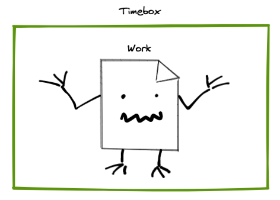

# Tip of the Week: Effective Non-technical Software Habits

> Each week we seek to provide a software tip of the week geared towards helping you achieve your software goals. If you have any software questions or suggestions for an upcoming tip of the week, please don’t hesitate to reach out to #software-engineering on Slack or email DBMISoftwareEngineering at olucdenver.onmicrosoft.com

__TLDR (too long, didn't read);__

## Controlling Time Expansion


_Image depicting work as a creature with a timebox around it._
{:.center}

Have you ever spent more time than you thought you would on a task? An adage which helps explain this phenomenon is [Parkinson's Law](https://www.economist.com/news/1955/11/19/parkinsons-law):

>"... work expands so as to fill the time available for its completion."

The practice of writing software is not protected from this "law". It may be effected by it in sometimes worse ways when considering long periods of uninterrupted programming (where we may have an inclination to pour our time into only a few items).

One way to address this is through the use of [timeboxing](https://en.wikipedia.org/wiki/Timeboxing) techiques. Timeboxing sets a fixed limit to the amount of time one may spend on a specific activity. One can use timeboxing to systematically address many tasks, for example, as with the [Pomodoro Technique](https://en.wikipedia.org/wiki/Pomodoro_Technique). While there are many ways to apply timeboxing, Pomodoro provides a way to balance activity with short breaks and focus switches to help ensure we don't become overwhelmed.

- [Wikipedia: Parkinson's Law](https://en.wikipedia.org/wiki/Parkinson%27s_law)
- [Wikipedia: Timeboxing](https://en.wikipedia.org/wiki/Timeboxing)
- [Wikipedia: Pomodoro Technique](https://en.wikipedia.org/wiki/Pomodoro_Technique)

## Timeboxing Means Modularization

Timeboxing has an auxiliary benefit of framing your work as objective and oftentimes smaller chunks (we have to know what we're timeboxing in order to use this technique). Creating distinct chunks of work applies for both our daily time schedule as well as code itself. This concept is more broadly called "[modularization](https://en.wikipedia.org/wiki/Modularity)" and helps to distinguish large portions of work (whether in real life or in code) as smaller and more maintainable chunks.

```markdown
# Goals
- Finish writing paper


```

_Vague and possibly large task_

```markdown
# Goals
- Finish writing paper
  - Create paper outline
  - Finish writing introduction
  - Check for dead hyperlinks
  - Request internal review
```

_Modular and more understandable tasks_

Breaking down large amounts of work as smaller chunks within our code helps to ensure long-term maintainability and understandability. Similarly, keeping our tasks small can help ensure our goals are achievable and understandable (to ourselves or others). Without this modularity, tasks can be impossible to achieve (subjective in nature) or very difficult to understand.

## Version Control and Timeboxing

```markdown
# Repo Issues
- "Prevent foo warning" - 20 minutes
- "Remove bar feature" - 20 minutes
- "Address baz error" - 20 minutes

```

The parallels between the time we give a task and related code can work towards your benefit. For example, [Github Issues](https://github.com/features/issues) can be created to outline a timeboxed task which relates to a distinct chunk of code to be created, updated, or fixed. Once development tasks have been outlined as issues, a developer can use timeboxing to help organize how much time to allocate on each issue.

Using Github Issues in this way provides a way to observe task progress associated with one or many repositories. It also increases collaborative opportunities for task sizing and description. For example, if a task looks too large to complete in a reasonable amount of time, developers may work together to break the task down into smaller modules of work.

## Additional Resources

-
