# Python Memory Management and Troubleshooting



## Introduction

<!-- excerpt start -->
Have you ever run Python code only to find it taking _forever_ to complete or sometime abruptly ending with an error like: `123456 Killed` or `killed (program exited with code: 137)`?
You may have experienced memory resource or management challenges associated with these scenarios.
This post will cover some computer memory definitions, how Python makes use of computer memory, and share some tools which may help with these types of challenges.
<!-- excerpt end -->

## What is Software?

<!-- set a max width for mermaid diagram below so it doesn't render so large -->
<style>
.mermaid {
  display: block;
  margin: 0 auto;
  max-height: 400px;
}
</style>

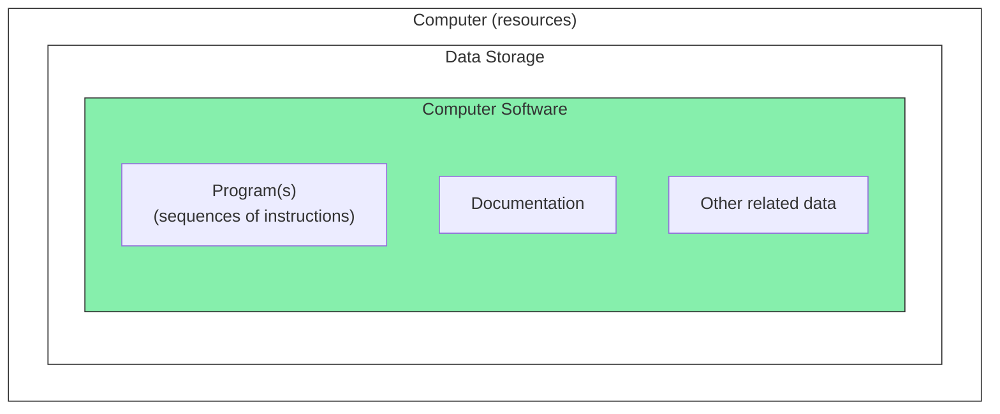

_Computer software includes programs, documentation, and other data maintained on computer data storage._
{:.center}

Computer software is the collection of programs and data which are used to accomplish a specific tasks on a computer.
"A __computer program__ is a sequence or set of instructions in a programming language for a computer to execute. It is one component of software, which also includes documentation and other intangible components." ([Wikipedia: Computer program](https://en.wikipedia.org/wiki/Computer_program)).
Computer programs in their human-readable form are stored as __source code__.
Source code is often maintained on [computer data storage](https://en.wikipedia.org/wiki/Computer_data_storage).

## What is Memory?

### Computer Memory

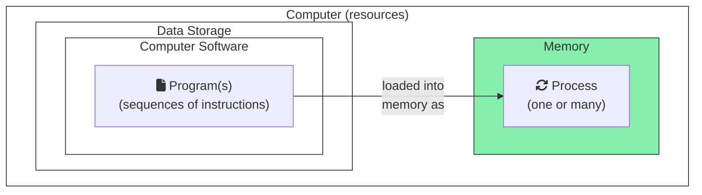

_Computer memory is a type of computer resource available for use by processes on a computer._
{:.center}

Computer memory, also sometimes known as "RAM" or "random-access memory", or "dynamic memory" is a type of resource used by computer software on a computer.
_"Computer memory stores information, such as data and programs for immediate use in the computer. ... Main memory operates at a high speed compared to non-memory storage which is slower but less expensive and oftentimes higher in capacity. " ([Wikipedia: Computer memory](https://en.wikipedia.org/wiki/Computer_memory))._
When we execute a computer program it becomes a [process](https://en.wikipedia.org/wiki/Process_(computing)) (or sometimes many processes).
Processes are loaded into computer memory to follow the instructions and other data provided from their related computer programs.



The word "speed" in the above context is sometimes used to describe  the delay before an operation on a computer completes (also known as _latency_).
See the following on [Computer] [Latency Numbers Everyone Should Know](https://www.softwareyoga.com/latency-numbers-everyone-should-know/) to better understand relative computer operation speeds.





<table>
<tr>
<th style="background-color:#E9DCFB;">Process Memory Segment</th>
<th style="background-color:#eee;">Purpose</th>
</tr>
<tr>
<td style="background-color:#E9EAFB;">Stack</td>
<td>Contains information about sequences of program instructions as functions or subroutines.</td>
</tr>
<tr>
<td style="background-color:#E9EAFB;">Heap</td>
<td>Area where memory for variables may be dynamically used.</td>
</tr>
<tr>
<td style="background-color:#E9EAFB;">Initialized data</td>
<td>Includes global and static variables which are explicitly initialized.</td>
</tr>
<tr>
<td style="background-color:#E9EAFB;">Uninitialized data</td>
<td>Includes global and static variables which are <strong>not</strong> explicitly initialized.</td>
</tr>
<tr>
<td style="background-color:#E9EAFB;">Text</td>
<td>Comprises program instructions for the process.</td>
</tr>
</table>

_Process memory is divided into segments which have specific purposes ([The Linux Programming Interface by Michael Kerrisk](https://learning.oreilly.com/library/view/the-linux-programming/9781593272203/xhtml/ch06.xhtml#ch06lev1sec03))._
{:.center}

Memory for a process is further divided into parts which are typically called _segments_.
Each process memory segment has a specific purpose and way of organizing things.
For the purposes of this content we'll focus on two of these segments: the stack and the heap.
The [___stack___ (sometimes also known as the "call stack")](https://en.wikipedia.org/wiki/Call_stack) includes information about sequences of program instructions packaged as units called ["functions" or "subroutines"](https://en.wikipedia.org/wiki/Function_(computer_programming)).
The stack also typically stores function local variables, arguments, and return value.
The [___heap___](https://en.wikipedia.org/wiki/Memory_management#HEAP) is an area where variables for a program may be dynamically stored.
The stack can be thought of as a <i class="icon fa-solid fa-map"></i> "roadmap" for what program will accomplish (including the location of things it will need to do that work).
The heap can be imagined of as a <i class="icon fa-solid fa-warehouse"></i> "warehouse" store (or remove) things used as part of the stack "roadmap".
Please see [The Linux Programming Interface by Michael Kerrisk, Chapter 6.3: Memory Layout of a Process](https://learning.oreilly.com/library/view/the-linux-programming/9781593272203/xhtml/ch06.xhtml#ch06lev1sec03) for more information about processes.


<!-- table HTML retained for replicability

<table>
<tr><th colspan="2">Memory Blocks</th></tr>
<tr>
<td>

<strong>A.)</strong> All memory blocks available.

<table>
<tr><td>Block</td><td>Block</td><td>Block</td></tr>
</table>

</td>
<td>

<strong>B.)</strong> Some memory blocks in use.

<table>
<tr><td style="background:#86EFAC;">Block</td><td style="background:#86EFAC;">Block</td><td>Block</td></tr>
</table>

</td>
</tr>
<tr>
<td colspan="2" style="text-align:center;font-weight:bold;">Practical analogy</td>
</tr>
<tr>
<td>

<strong>C.)</strong> You have limited boxes to hold things.

<table>
<tr><td>📦</td><td>📦</td><td>📦</td></tr>
</table>

</td>
<td>

<strong>D.)</strong> Two boxes are used, the other remains empty (ready for use).

<table>
<tr><td style="background:#86EFAC;">📦</td><td style="background:#86EFAC;">📦</td><td>📦</td></tr>
</table>

</td>
</tr>
</table>

-->



The heap is often further organized through the use of ___"blocks"___.
Memory blocks are chunks of memory of a certain [byte](https://en.wikipedia.org/wiki/Byte) or [bit](https://en.wikipedia.org/wiki/Bit) size (usually all the same size) ([Wikipedia: Block (data storage)](https://en.wikipedia.org/wiki/Block_(data_storage))).
Memory blocks may be in use or free at different times.
If the heap is a process memory <i class="icon fa-solid fa-warehouse"></i> "warehouse" then blocks are like <i class="icon fa-solid fa-boxes-stacked"></i> "boxes" inside the warehouse.

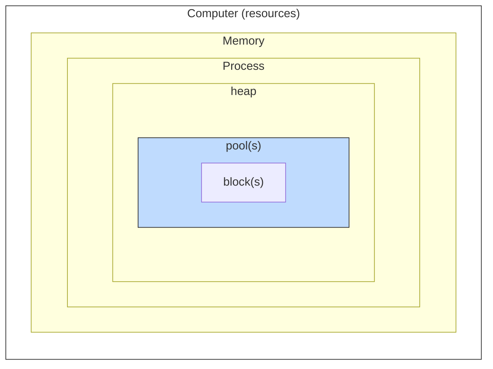

_Process memory heaps help organize memory blocks on a computer for specific procedures. Heaps may have one or many memory pools._
{:.center}

Blocks may be organized in hierarchical layers to manage memory efficiently or towards a specific purpose.
Blocks may sometimes be organized into [___pools___](https://en.wikipedia.org/wiki/Memory_pool) within the process memory heap segment.
Pools are areas of the heap used to efficiently manage blocks together in specific ways.
Each heap may have one or many pools (each with sets of blocks).
If the heap is a process memory <i class="icon fa-solid fa-warehouse"></i> "warehouse", and blocks are like <i class="icon fa-solid fa-boxes-stacked"></i> "boxes" inside the warehouse, pools are like <i class="icon fa-solid fa-boxes-packing"></i> "shelves" for organizing and moving those boxes within the warehouse.

### Memory Allocator

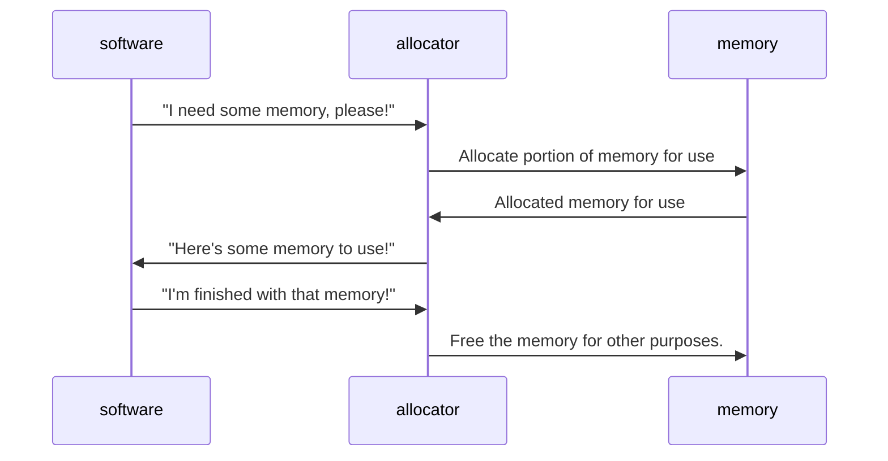

_Memory allocators help software reserve and free computer memory resources._
{:.center}

Memory management is a concept which helps enable the shared use of computer memory to avoid challenges such as memory overuse (where all memory is in use and never shared to other software).
Computer memory management often occurs through the use of a ___memory allocator___ which controls how computer memory resources are used for software.
Computer software is written to interact with memory allocators to use computer memory.
Memory allocators may be used manually (with specific directions provided on when and how to use memory resources) or automatically (with an algorithmic approach of some kind).
The memory allocator usually performs the following actions with memory (in addition to others):

- __"Allocation"__: computer memory resource reservation (taking memory). This is sometimes also known as "`alloc`", or "allocate memory".
- __"Deallocation"__: computer memory resource freeing (giving back memory for other uses). This is sometimes also known as "`free`", or "freeing memory from allocation".

### Garbage Collection

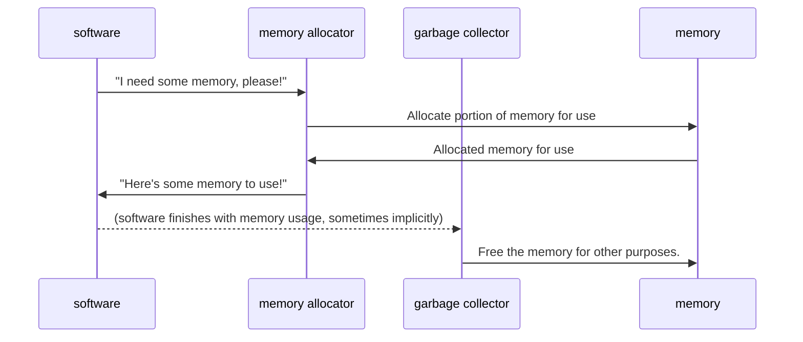

_Garbage collectors help free computer memory which is no longer referenced by software._
{:.center}

"Garbage collection (GC)" is used to describe a type of automated memory management.
GC is typically used to help reduce human error, avoid unintentional system failures, and decrease development time (through less memory-specific code).
"The _garbage collector_ attempts to reclaim memory which was allocated by the program, but is no longer referenced; such memory is called _garbage_." ([Wikipedia: Garbage collection (computer science)](<https://en.wikipedia.org/wiki/Garbage_collection_(computer_science)>)).
A garbage collector often works in tandem with a memory allocator to help control computer memory resource usage in software development.

## How Does Python Interact with Computer Memory?

### Python Overview

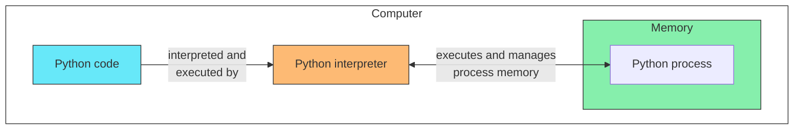

_A Python interpreter executes Python code and manages memory for Python procedures._
{:.center}

Python is an interpreted "high-level" programming language ([Python: What is Python?](https://www.python.org/doc/essays/blurb/)).
Interpreted languages are those which include an "interpreter" which helps execute code written in a particular way ([Wikipedia: Interpreter (computing)](<https://en.wikipedia.org/wiki/Interpreter_(computing)>)).
High-level languages such as Python often remove the requirement for software developers to manually perform memory management ([Wikipedia: High-level programming language](https://en.wikipedia.org/wiki/High-level_programming_language)).

Python code is executed by a commonly pre-packaged and downloaded binary call the Python [interpreter](<https://en.wikipedia.org/wiki/Interpreter_(computing)>).
The Python interpreter reads Python code and performs memory management as the code is executed.
The [CPython Python interpreter](https://github.com/python/cpython) is the most commonly used interpreter for Python, and what's use as a reference for other content here.
There are also other interpreters such as [PyPy](https://www.pypy.org/features.html), [Jython](https://github.com/jython/jython), and [IronPython](https://ironpython.net/) which all handle memory differently than the CPython interpreter.

### Python's Memory Manager

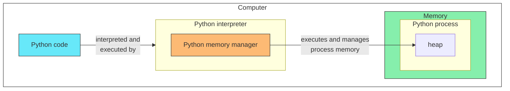

_The Python memory manager helps manage memory in the heap for Python processes executed by the Python interpreter._
{:.center}

Memory is managed for Python software processes automatically (when unspecified) or manually (when specified) through the Python interpreter.
The ___Python memory manager___ is an abstraction which manages memory for Python software processes through the Python interpreter ([Python: Memory Management](https://docs.python.org/3/c-api/memory.html)).
From a high-level perspective, we assume variables and other operations written in Python will automatically allocate and deallocate memory through the Python interpreter when executed.
Python's memory manager performs work through various __memory allocators__ and a __garbage collector__ (or as configured with customizations) within a __private Python memory heap__.

### Python's Memory Allocators

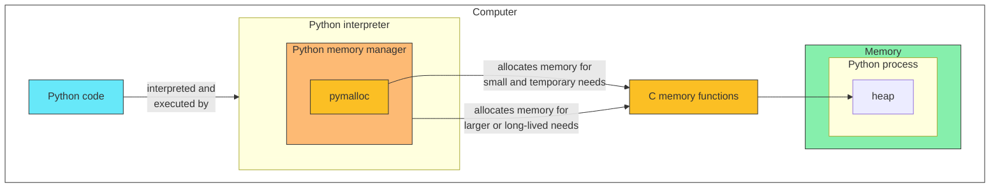

_The Python memory manager by default will use `pymalloc` internally or malloc from the system to allocate computer memory resources._
{:.center}

The Python memory manager allocates memory for use through memory allocators.
Python may use one or many memory allocators depending on specifications in Python code and how the Python interpreter is configured (for example, see [Python: Memory Management - Default Memory Allocators](https://docs.python.org/3/c-api/memory.html#default-memory-allocators)).
One way to understand Python memory allocators is through the following distinctions.

- __"Python Memory Allocator" (`pymalloc`)__
  The Python interpreter is packaged with a specialized memory allocator called `pymalloc`.
  "Python has a pymalloc allocator optimized for small objects (smaller or equal to 512 bytes) with a short lifetime." ([Python: Memory Management - The pymalloc allocator](https://docs.python.org/3/c-api/memory.html#the-pymalloc-allocator)).
  Ultimately, `pymalloc` uses C standard library dynamic memory allocation functions to implement memory work.
- __C dynamic memory allocation functions (`malloc`, `realloc`, etc.)__
  When `pymalloc` is disabled or a memory requirements exceed `pymalloc`'s constraints, the Python interpreter will directly use a function from the [C standard library](https://en.wikipedia.org/wiki/C_standard_library) called [C standard library dynamic memory allocation functions](https://en.wikipedia.org/wiki/C_dynamic_memory_allocation).
  When C standard library dynamic memory allocation functions are used by the Python interpreter, it uses the system's existing implementation of the C standard library.

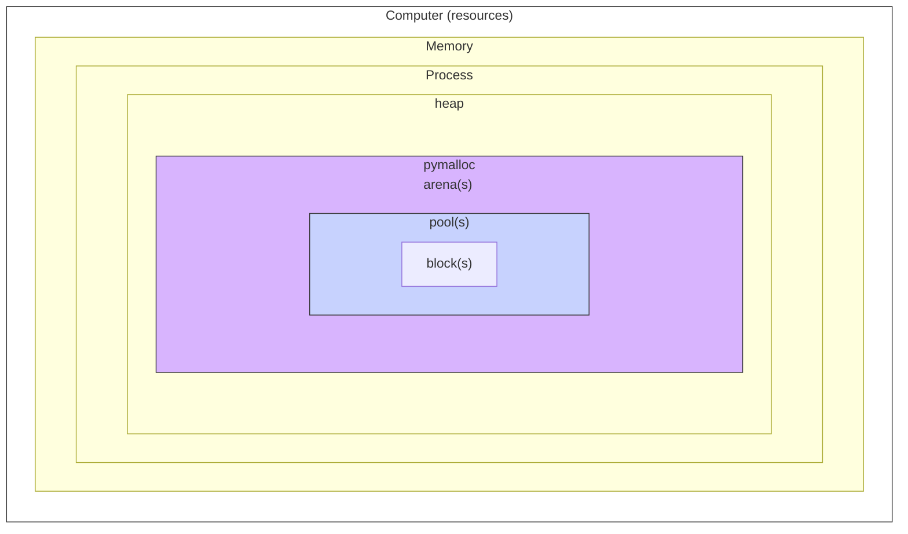

_`pymalloc` makes use of arenas to further organize pools within a Python process memory heap._
{:.center}

It's important to note that `pymalloc` adds additional abstractions to how memory is organized through the use of "arenas".
These arenas are specific to `pymalloc` purposes.
`pymalloc` may be disabled through the use of a special environment variable called [`PYTHONMALLOC`](https://docs.python.org/3/using/cmdline.html#envvar-PYTHONMALLOC) (for example, to use only [C standard library dynamic memory allocation functions](https://en.wikipedia.org/wiki/C_dynamic_memory_allocation) as seen below).
This same environment variable may be used with `debug` settings in order to help troubleshoot in-depth questions.

__Additional Python Memory Allocators__

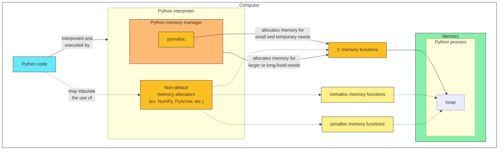

_Python code may stipulate the use of additional memory allocators, such as `mimalloc` and `jemalloc` outside of the default Python memory manager's operation._
{:.center}

Python provides the capability of customizing memory allocation through the use of custom code or non-default packages.
See below for some notable examples of additional memory allocation possibilities.

- __NumPy Memory Allocation__
  [NumPy](https://numpy.org/) [uses custom C-API's](https://numpy.org/doc/stable/reference/c-api/data_memory.html) which are backed by C dynamic memory allocation functions (`alloc`, `free`, `realloc`) to help address memory management.
  These interfaces can be controlled directly through NumPy to help manage memory effectively when using the package.
- __PyArrow Memory Allocators__
  [PyArrow](https://arrow.apache.org/) provides the capability to use C standard library dynamic memory allocation functions, [`jemalloc`](https://github.com/jemalloc/jemalloc), or [`mimalloc`](https://github.com/microsoft/mimalloc) through the [PyArrow Memory Pools group of functions](https://arrow.apache.org/docs/python/api/memory.html#memory-pools).
  A default memory allocator is selected for use when PyArrow based on the operating system and the availability of the memory allocator on the system.
  The selection of a memory allocator for use with PyArrow can be influenced by how it performs on a particular system.

### Python Reference Counting

<!-- table HTML retained for replicability 

<table>
<tr><th>Processed line of code</th><th>Reference count</th></tr>
<tr>

<td>

```python
a_string = "cornucopia"
```

</td>
<td>
a_string: 1
</td>
<tr>
<td>

```python
reference_a_string = a_string
```

</td>
<td>
a_string: 2<br>
(Because `a_string` is now referenced twice.)
</td>
</tr>
<tr>
<td>

```python
del reference_a_string
```

</td>
<td>
a_string: 1<br>
(Because the additional reference has been deleted.)
</td>
</tr>

</table>

-->



As computer memory is allocated to Python processes the Python memory manager keeps track of these through the use of a [reference counter](https://en.wikipedia.org/wiki/Reference_counting).
In Python, we could label this as an "Object reference counter" because all data in Python is represented by objects ([Python: Data model](https://docs.python.org/3/reference/datamodel.html#objects-values-and-types)).
"... CPython counts how many different places there are that have a reference to an object. Such a place could be another object, or a global (or static) C variable, or a local variable in some C function." ([Python Developer's Guide: Garbage collector design](https://devguide.python.org/internals/garbage-collector/)).

### Python's Garbage Collection

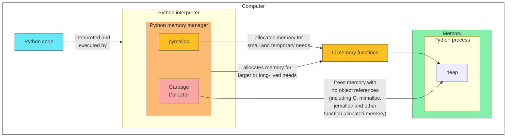

_The Python garbage collector works as part of the Python memory manager to free memory which is no longer needed (based on reference count)._
{:.center}

Python by default uses an optional garbage collector to automatically deallocate garbage memory through the Python interpreter in CPython.
"When an object’s reference count becomes zero, the object is deallocated." ([Python Developer's Guide: Garbage collector design](https://devguide.python.org/internals/garbage-collector/))
Python's garbage collector focuses on collecting garbage created by `pymalloc`, C memory functions, as well as other memory allocators like `mimalloc` and `jemalloc`.

## Python Tools for Observing Memory Behavior

### Python Built-in Tools

```python
import gc
import sys

# set gc in debug mode for detecting memory leaks
gc.set_debug(gc.DEBUG_LEAK)

# create an int object
an_object = 1

# show the number of uncollectable references via COLLECTED
COLLECTED = gc.collect()
print(f"Uncollectable garbage references: {COLLECTED}")

# show the reference count for an object
print(f"Reference count of `an_object`: {sys.getrefcount(an_object)}")
```

The [`gc` module](https://docs.python.org/3/library/gc.html) provides an interface to the Python garbage collector.
In addition, the [`sys` module](https://docs.python.org/3/library/sys.html) provides many functions which provide information about references and other details about Python objects as they are executed through the interpreter.
These functions and other packages can help software developers observe memory behaviors within Python procedures.

### Python Package: Scalene



[Scalene](https://github.com/plasma-umass/scalene) is a Python package for analyzing memory, CPU, and GPU resource consumption.
It provides [a web interface](https://github.com/plasma-umass/scalene?tab=readme-ov-file#web-based-gui) to help visualize and understand how resources are consumed.
Scalene provides suggestions on which portions of your code to troubleshoot through the web interface.
Scalene can also be configured to work with [OpenAI](https://en.wikipedia.org/wiki/OpenAI) [LLM's](https://en.wikipedia.org/wiki/Large_language_model) by way of a an [OpenAI API  provided by the user](https://github.com/plasma-umass/scalene?tab=readme-ov-file#ai-powered-optimization-suggestions).

### Python Package: Memray



[Memray](https://github.com/bloomberg/memray) is a Python package to track memory allocation within Python and compiled extension modules.
Memray provides a high-level way to investigate memory performance and adds visualizations such as [flamegraphs](https://www.brendangregg.com/flamegraphs.html) (which contextualization of [stack traces](https://en.wikipedia.org/wiki/Stack_trace) and memory allocations in one spot).
Memray seeks to provide a way to overcome challenges with tracking and understanding Python and other memory allocators (such as C, C++, or Rust libraries used in tandem with a Python process).

## Concluding Thoughts

It's worth mentioning that this article covers only a small fraction of how and what memory is as well as how Python might make use of it.
Hopefully it clarifies the process and provides a way to get started with investigating memory within the software you work with.
Wishing you the very best in your software journey with memory!
