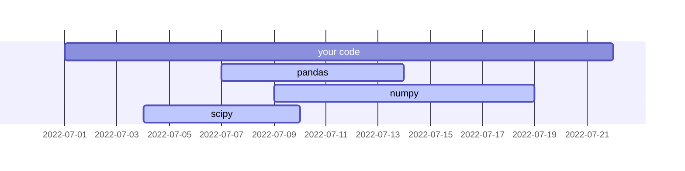
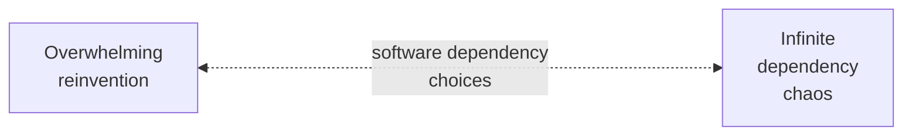
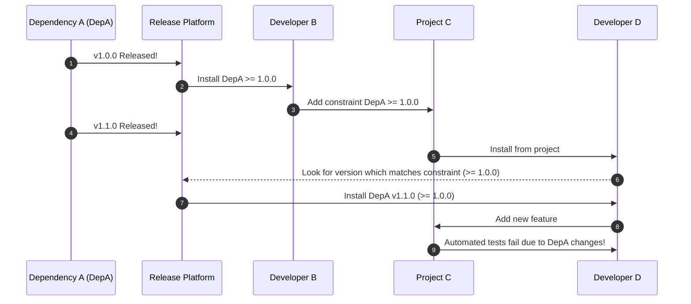

# Lockfiles



## Introduction

<!-- excerpt start -->
Writing software often entails using code from other people to solve common challenges and take advantage of existing work.
External software used by a specific project can be called a "dependency" (the software "depends" on that external work to accomplish tasks).
Collections of software are oftentimes made available as "packages" through various platforms.
[Package management](https://en.wikipedia.org/wiki/Package_manager) for dependencies, the task of managing collections of dependencies for a specific project, is a specialized area of software development that can involve the use of unique tools and files.
This article will cover package dependency management through special files generally referred to as "lockfiles".
<!-- excerpt end -->

## Why use dependencies?

- Example spectrum between including others work vs writing everything yourself. | <--------------> |

There are various advantages to using packaged dependencies in your projects.
Using existing work this way practices a collective ["don't repeat yourself [or ourselves]" (DRY)](https://en.wikipedia.org/wiki/Don%27t_repeat_yourself) to avoid [reinventing the wheel](https://en.wikipedia.org/wiki/Reinventing_the_wheel).
Using dependencies allows us to make explicit decisions about the specific focus, or context, which the project will prioritize.

The concept of [bounded context](https://martinfowler.com/bliki/BoundedContext.html) from [domain-driven design](https://en.wikipedia.org/wiki/Domain-driven_design) is sometimes used to help distinguish what is in or out of scope for a particular project.
Bounded context can be used as a way to draw abstract lines around a certain [span of control](https://en.wikipedia.org/wiki/Span_of_control) in order to align available resources (like time and people) with the focus of the project.
Without these considerations and the use of dependencies we might face "endless" software [feature creep](https://en.wikipedia.org/wiki/Feature_creep) by continually adding new bounded contexts that are outside of our span of control (or resources).

## The dependency wilderness

<!-- set a max width for mermaid diagram below so it doesn't render so large -->

_Caption here._
{:.center}

Using existing software package dependencies helps conserve resources but comes with unique challenges related to unpredictability (such as when those dependencies are updated).
This unpredictability can sometimes result in what's colloquially called ["dependency hell"](https://en.wikipedia.org/wiki/Dependency_hell), where for example multiple external dependencies conflict with one another and are unable to be automatically resolved.
These challenges can be especially frustrating due to when they occur (often outside of our personal schedule awareness) and how long they can take to debug (finding fixes sometimes entails costly [trial-and-error](https://en.wikipedia.org/wiki/Trial_and_error)).

_Software dependency choices may be understood through careful consideration between the cost of reinvention vs (external) dependency chaos._
{:.center}

Dependency chaos can sometimes lead to ["not invented here syndrome"](https://en.wikipedia.org/wiki/Not_invented_here) where there's less trust in external-facing work outside of an individual or group of people.
When or if this happens it can be important to reconsider existing knowledge on a topic area through formal or informal [literature review](https://en.wikipedia.org/wiki/Literature_review) (understanding that code within software is a type of literature).
Outlining existing work through a literature review can help with [second-order thinking revision](https://en.wikipedia.org/wiki/Revision_(writing)#Reflection_in_the_revision_process) where we might benefit from reflecting on dependency decision-making again after an initial (first-order) creative process.

## Package dependency specification

<table>
<tr>
<th>Version constraint</th>
<th>Natural language description</th>
</tr>
<tr>
<td>

`==2.1.0`

</td>
<td>Exactly and only version 2.1.0</td>
</tr>
<tr>
<td>

`>=2.0.0`

</td>
<td>Greater than or equal to version 2.0.0</td>
</tr>
<tr>
<td>

`>=2.0.0, <3.0.0`

</td>
<td>Greater than or equal to version 2.0.0 and less than 3.0.0</td>
</tr>
<tr>
<td>

`>=2.0.0, <3.0.0, !=2.5.1`

</td>
<td>Greater than or equal to version 2.0.0, less than 3.0.0, and anything that's not exactly version 2.5.1</td>
</tr>
</table>

_Version constraint specifications provide code-based descriptions for dependency versions within your project (Pythonic version specification examples above)._
{:.center}

Many aspects of dependency chaos arise from the fact that dependencies are updated at various times.
We often want to make certain we use the most up-to-date version of a dependency because those updates may come with performance, corrective, or other benefits.
To accomplish this we can use what are sometimes called dependency "version range constraints" or "compliant version specifications" to provide some flexibility in how packages are installed for our projects.
These are often specific to the package management system and programming language being used.
See the [Python Packaging Authority's Version Specifiers section](https://packaging.python.org/en/latest/specifications/version-specifiers/#id5) for an example of how these version constraints work.

## Version constraint flexibility can be chaotic

_Unintentional failures can occur due to timeline variations between internal projects and external dependencies._
{:.center}

In addition to the flexibility of version range specifications we sometimes require repeatable behavior to be productive with a project.
For example, we want for each developer and continuous integration step to have reproducible environments even if a dependency gets updated while internal development takes place.

## Using lockfiles

- 
- Dependabot https://github.blog/2020-06-01-keep-all-your-packages-up-to-date-with-dependabot/
- Renovate https://github.com/renovatebot/renovate

## Examples

- Python:
  - [Poetry `poetry.lock` file](https://python-poetry.org/docs/basic-usage/#committing-your-poetrylock-file-to-version-control)
  - [PDM `pdm.lock` file](https://pdm-project.org/latest/usage/dependency/#specify-the-lockfile-to-use)
- Conda: [`conda-lock` `conda-lock.yml`](https://github.com/conda/conda-lock)
- R: [`renv` `renv.lock` file](https://rstudio.github.io/renv/articles/lockfile.html)
- Ruby: [Rubygems Gemfile.lock files](https://bundler.io/guides/rationale.html#checking-your-code-into-version-control)
- JavaScript: 
  - [NPM `package-lock.json` files](https://docs.npmjs.com/cli/v10/configuring-npm/package-lock-json)
  - [Yarn `yarn.lock` files](https://classic.yarnpkg.com/lang/en/docs/yarn-lock/)
- Rust: [Cargo `cargo.lock` file](https://doc.rust-lang.org/cargo/guide/cargo-toml-vs-cargo-lock.html)

## Concluding Thoughts

