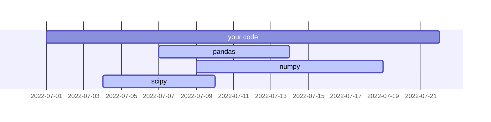

# Lockfiles



## Introduction

<!-- excerpt start -->
<!-- excerpt end -->

## What are dependencies? 📦

- Example spectrum between including others work vs writing everything yourself. | <--------------> |
- [Reinventing the wheel](https://en.wikipedia.org/wiki/Reinventing_the_wheel)
- [Not invented here](https://en.wikipedia.org/wiki/Not_invented_here)
- [Bounded context](https://martinfowler.com/bliki/BoundedContext.html)

## The dependency wilderness 🌲

<!-- set a max width for mermaid diagram below so it doesn't render so large -->

_Caption here._
{:.center}

- Parallel timelines
- Dependency chaos
- Dependency management

## Information Entropy

- [Entropy (information theory)](https://en.wikipedia.org/wiki/Entropy_(information_theory))
- Dependency entropy
- Systems theory stocks, flows, and uncertainty

## Dependency uncertainty

- Dependency version ranges
- Continuous Integration
- Developer experience (DevEx)

## Reducing uncertainty with lockfiles

- Snapshots in time with lockfiles
- Layers of depenedency certainty

## Using lockfiles

- 
- Dependabot https://github.blog/2020-06-01-keep-all-your-packages-up-to-date-with-dependabot/
- Renovate https://github.com/renovatebot/renovate

## Examples

- Python:
  - [Poetry `poetry.lock` file](https://python-poetry.org/docs/basic-usage/#committing-your-poetrylock-file-to-version-control)
  - [PDM `pdm.lock` file](https://pdm-project.org/latest/usage/dependency/#specify-the-lockfile-to-use)
- Conda: [`conda-lock` `conda-lock.yml`](https://github.com/conda/conda-lock)
- R: [`renv` `renv.lock` file](https://rstudio.github.io/renv/articles/lockfile.html)
- Ruby: [Rubygems Gemfile.lock files](https://bundler.io/guides/rationale.html#checking-your-code-into-version-control)
- JavaScript: 
  - [NPM `package-lock.json` files](https://docs.npmjs.com/cli/v10/configuring-npm/package-lock-json)
  - [Yarn `yarn.lock` files](https://classic.yarnpkg.com/lang/en/docs/yarn-lock/)
- Rust: [Cargo `cargo.lock` file](https://doc.rust-lang.org/cargo/guide/cargo-toml-vs-cargo-lock.html)

## Concluding Thoughts

