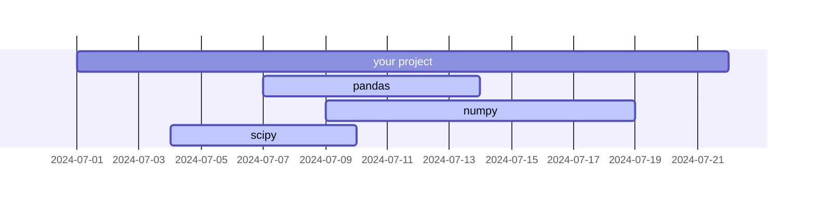
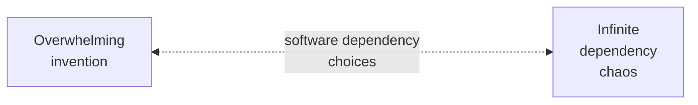
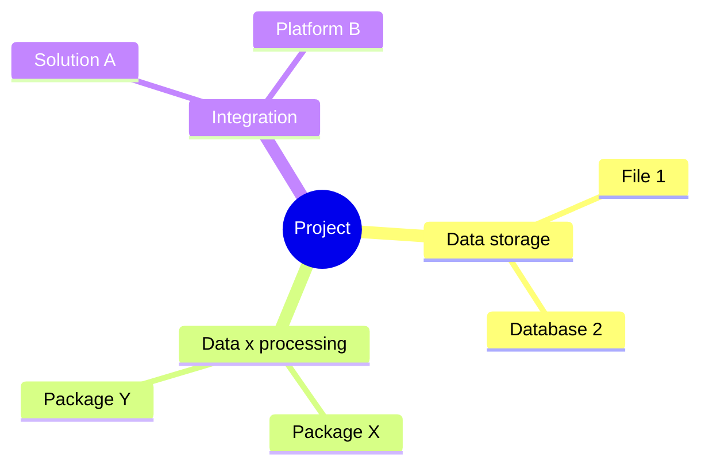
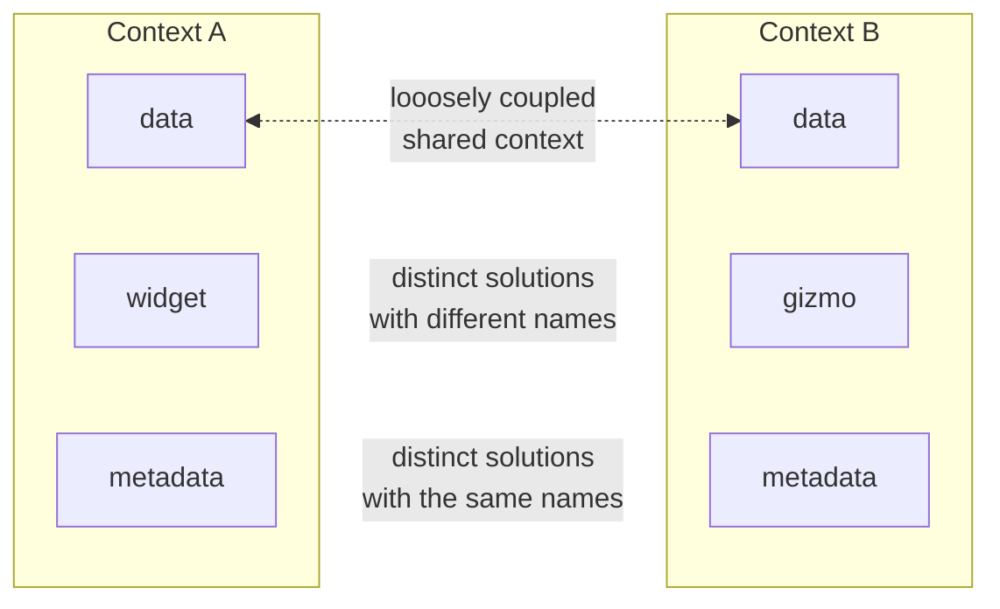
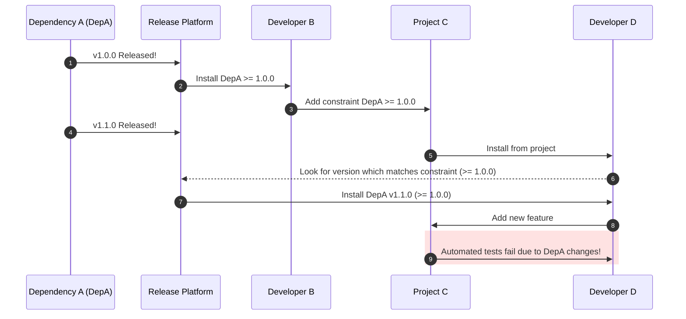
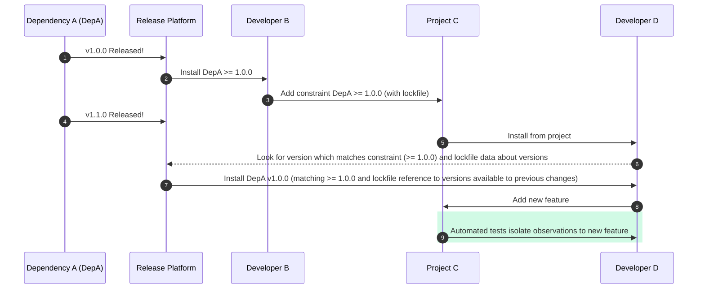
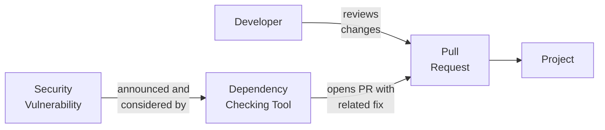

# Navigating Dependency Chaos with Lockfiles



## Introduction

<!-- excerpt start -->
Writing software often entails using code from other people to solve common challenges and take advantage of existing work.
External software used by a specific project can be called a "dependency" (the software "depends" on that external work to accomplish tasks).
Collections of software are oftentimes made available as "packages" through various platforms.
[Package management](https://en.wikipedia.org/wiki/Package_manager) for dependencies, the task of managing collections of dependencies for a specific project, is a specialized area of software development that can involve the use of unique tools and files.
This article will cover package dependency management through special files generally referred to as "lockfiles".
<!-- excerpt end -->

## Why use dependencies?



There are various advantages to using packaged dependencies in your projects.
Using existing work this way practices a collective ["don't repeat yourself [or ourselves]" (DRY)](https://en.wikipedia.org/wiki/Don%27t_repeat_yourself) among the global community of software developers to avoid [reinventing the wheel](https://en.wikipedia.org/wiki/Reinventing_the_wheel).
Using dependencies allows us to make explicit decisions about the specific focus, or context, which the project will prioritize.
While it's oftentimes easy to include and use dependencies in a project they come with risks that are important to consider.

## The dependency wilderness

<!-- set a max width for mermaid diagram below so it doesn't render so large -->

_Dependencies are often on their own unpredictable schedule outside of your project's control._
{:.center}

Using existing software package dependencies helps conserve resources but comes with unique challenges related to unpredictability (such as when those dependencies are updated).
This unpredictability can sometimes result in what's colloquially called ["dependency hell" or "dependency chaos"](https://en.wikipedia.org/wiki/Dependency_hell), where for example multiple external dependencies conflict with one another and are unable to be automatically resolved (among other issues).
These challenges can be especially frustrating due to when they occur (often outside of our personal schedule awareness) and how long they can take to debug (finding fixes sometimes entails costly [trial-and-error](https://en.wikipedia.org/wiki/Trial_and_error)).
It can feel like walking through a forest at night without a flashlight, constantly tripping over roots or running into stumps and branches!

## Illuminating the dependency thicket

_Software dependency choices may be understood through careful consideration between the cost of internal overwhelming invention vs external dependency chaos._
{:.center}

Dependency chaos can sometimes lead to ["not invented here syndrome"](https://en.wikipedia.org/wiki/Not_invented_here) where there's less trust in external-facing work outside of an individual or group of people.
When or if this happens it can be important to understand dependencies as a __scale of choices between overwhelming invention and infinite dependency chaos__.
For example, to accomplish a small project it may not be wise to create a brand new programming language (towards the extreme of overwhelming invention).
On the other hand, if we depended upon all existing work within a certain context the solution may not be specialized, efficient, or resourceful enough to meet the goals within a reasonable amount of time.

_Dependency awareness and opportunity can be grouped into concerns and documented as part of a literature review (seen here as a [mind map](https://en.wikipedia.org/wiki/Mind_map))._
{:.center}

It can be helpful to reconsider existing knowledge on a topic area through formal or informal [literature review](https://en.wikipedia.org/wiki/Literature_review) (understanding that code within software is a type of literature) when thinking about the scale of decisions mentioned above.
Outlining existing work through a literature review can help with [second-order thinking revision](https://en.wikipedia.org/wiki/Revision_(writing)#Reflection_in_the_revision_process) where we might benefit from reflecting on dependency decision-making again after an initial (first-order) creative process.
Each potential dependency discovered through this process can be organized using [separation of concerns (SoC)](https://en.wikipedia.org/wiki/Separation_of_concerns) under specific _concern_ labels, or a general set of information which affects related code.
Include dependencies within your project which will helpfully limit the code produced (or SoC _sections_) thereby reducing the overall amount of _concerns_ the project must maintain.

_Bounded contexts along with shared or distinct components can be used to help limit the complexity of a project in helpful ways._
{:.center}

The concept of [bounded context](https://martinfowler.com/bliki/BoundedContext.html) from [domain-driven design](https://en.wikipedia.org/wiki/Domain-driven_design) can sometimes be used to help distinguish what is in or out of scope for a particular project as a way of reducing complexity.
Bounded context can be used as a way to draw abstract lines around a certain [span of control](https://en.wikipedia.org/wiki/Span_of_control) in order to align available resources (like time and people) with the focus of the project.
It also can help promote [loose coupling](https://en.wikipedia.org/wiki/Loose_coupling) of software components in order to enable flexible design over time.
Without these considerations and the use of dependencies we might face "endless" software [feature creep](https://en.wikipedia.org/wiki/Feature_creep) by continually adding new bounded contexts that are outside of our span of control (or resources).

## Version constraints as dependency specification control

<table>
<tr>
<th>Version constraint</th>
<th>Description of the version constraint</th>
</tr>
<tr>
<td>

`==2.1.0`

</td>
<td>Exactly and only version 2.1.0</td>
</tr>
<tr>
<td>

`>=2.0.0`

</td>
<td>Greater than or equal to version 2.0.0</td>
</tr>
<tr>
<td>

`>=2.0.0, <3.0.0`

</td>
<td>Greater than or equal to version 2.0.0 and less than 3.0.0</td>
</tr>
<tr>
<td>

`>=2.0.0, <3.0.0, !=2.5.1`

</td>
<td>Greater than or equal to version 2.0.0, less than 3.0.0, and anything that's not exactly version 2.5.1</td>
</tr>
</table>

_Version constraint specifications provide code-based descriptions for dependency versions within your project (Pythonic version specification examples above)._
{:.center}

Many aspects of dependency chaos arise from the fact that dependencies are updated at various times.
We often want to make certain we use the most up-to-date version of a dependency because those updates may come with performance, corrective, or other benefits.
To accomplish this we can use what are sometimes called dependency "version range constraints" or "compliant version specifications" to provide some flexibility in how packages are installed for our projects.
These are often specific to the package management system and programming language being used.
See the [Python Packaging Authority's Version Specifiers section](https://packaging.python.org/en/latest/specifications/version-specifiers/#id5) for an example of how these version constraints work.

## Version constraints can still be chaotic

_Unintentional failures can occur due to timeline variations between internal projects and external dependencies._
{:.center}

We sometimes require repeatable behavior to be productive with a project in addition to the flexibility of version range specifications.
For example, we may want for each developer and continuous integration step to have reproducible environments even if a dependency gets updated while internal development takes place.
Dependency version constraints oftentimes aren't enough on their own to prevent reproducibility issues from occurring.
See the above diagram for a timeline depicting how `Developer B` and `Developer D` may have different experiences despite best efforts with version constraints (`Dependency A` may make a release that fits the version constraint but breaks `Project C` when `Developer D` tries to modify unrelated code).

## Lockfiles for reproducible version constraint behavior

Version constraint lockfiles provide one way to ensure reproducible behaviors within your projects.

Lockfiles usually have the following characteristics (this varies by programming language and dependency type):

- Lockfiles usually capture data about existing available dependencies which match a provided version constraint specification as a single file which can be added to source control.
- Lockfiles are referenced when available to help create reproducible installations of dependencies.
- Lockfiles are often automatically created or changed by a package or environment management tool of some kind.

See the above modified timeline for `Developer B` and `Developer D` to better understand how their project will benefit from a shared lockfile and reproducible dependency installations.

## Pythonic Example

<table>
<tr>
<th>Python Poetry command used</th>
<th>Description of what occurs</th>
</tr>
<tr>
<td>

`poetry add pandas`

</td>
<td>

- Adds a [__caret-based version constraint specification__](https://python-poetry.org/docs/dependency-specification/#caret-requirements) based on the latest release (for example `^2.2.1`) within a `pyproject.toml` file. This version constraint can be understood as `>= 2.2.1, < 2.3.0`.
- Create or update the `poetry.lock` lockfile with known compatible versions of Pandas based on the version constraint mentioned above.
- Installs the version of Pandas which matches the `pyproject.toml` and `poetry.lock` specifications.

</td>
</tr>
<tr>
<td>

`poetry install`

</td>
<td>

Installs the version of Pandas which matches the `pyproject.toml` and `poetry.lock` specifications (for example, within a new environment or for another developer).

</td>
</tr>
<tr>
<td>

`poetry update pandas`

</td>
<td>

- Poetry checks for available Pandas releases which are compatible with the version constraint (for ex. `^2.2.1`).
- If there are new versions available which match the constraint, Poetry will update the `poetry.lock` lockfile and install the matching version.

</td>
</tr>
<tr>
<td>

`poetry lock`

</td>
<td>

- Update all dependencies referenced in the `poetry.lock` lockfile with the latest compatible versions based on the version constraints specified within the `pyproject.toml`.
- Optionally, if the `--no-update` flag is also used, refresh the dependency versions referenced within the `poetry.lock` lockfile based on version constraints specified within the `pyproject.toml` without seeking updated dependency releases.

</td>
</tr>
</table>

_Use Poetry commands to implement dependency version constraints and lockfiles for reproducible Python project environments._
{:.center}

[Poetry](https://python-poetry.org/) is a Python packaging and dependency management tool which implements version constraints and lockfiles to help developers maintain their software projects.
Using commands like `poetry add ...` and `poetry lock` automatically creates `poetry.lock` lockfiles based on specifications which are added either automatically or manually to `pyproject.toml` files.
Similar to other tools, Poetry can operate with or without `poetry.lock` lockfiles ([see here for more information](https://python-poetry.org/docs/basic-usage/#committing-your-poetrylock-file-to-version-control)).
Another alternative to Poetry which makes use of lockfiles is [PDM (`pdm.lock` files)](https://pdm-project.org/latest/usage/dependency/#specify-the-lockfile-to-use). 

## Avoiding over-constrained dependencies

_Automated dependency checking tools like Dependabot or Renovate can be used to reduce project risk through timely dependency update changes assisted by human reviewers._
{:.center}

Using dependency version constraints and lockfiles are helpful for reproducibility but imply a risk of over-constraint.
Two important over-constraint considerations are:

- __Bug fixes:__ we may perpetuate an incorrect or failing solution within our project as the result of not installing later releases of a dependency.
- __Security fixes:__ we may unknowingly create security risks for others through the inclusion of known [security vulnerable](https://en.wikipedia.org/wiki/Vulnerability_(computing)) dependency versions.

Make sure to address these risks by routinely considering whether your dependencies need to be updated (manually) or through the use of automated tools like [GitHub's Dependabot](https://github.blog/2020-06-01-keep-all-your-packages-up-to-date-with-dependabot/) or [Mend Renovate](https://github.com/renovatebot/renovate).
Tools like Dependabot or Renovate enable scheduled checks and updates to be applied to your project which can lead to a balanced way of ensuring risk reduction and productive future-focused development.

## Concluding Thoughts

This article covered why dependencies are used, what complications they come with, and some tools to use addressing those challenges.
Every project can vary quite a bit when it comes to dependency management decision making and maintenance.
We hope you find success with dependency management through these and look forward to providing more information on this topic in the future.
